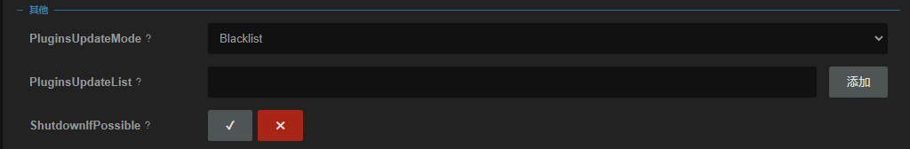
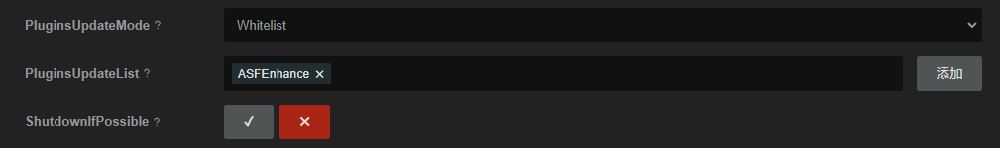

# ASFEnhance


[](https://www.codacy.com/gh/chr233/ASFEnhance/dashboard)

[](https://github.com/chr233/ASFEnhance/blob/master/license)
[](https://crowdin.com/project/asfenhance)

[](https://github.com/chr233/ASFEnhance/releases)
[](https://github.com/chr233/ASFEnhance/releases)


[](https://img.shields.io/github/v/release/chr233/ASFEnhance)

[](https://space.bilibili.com/5805394)
[](https://steamcommunity.com/id/Chr_)

[](https://steamcommunity.com/tradeoffer/new/?partner=221260487&token=xgqMgL-i)
[![爱发电][afdian_img]][afdian_link]
[![buy me a coffee][bmac_img]][bmac_link]

[中文说明](README.md) | [Русская Версия](README.ru.md)

## EULA

> Please do not use this plugin to conduct repulsive behaviors, including but not limited to: post fake reviews, posting
> advertisements, etc.
>
> See [Plugin Configuration](#plugin-configuration)

## EVENT COMMAND

> This group of commands is only available for a limited time, and will be removed when the next version of this plugin
> is published if they lose efficacy

| Command                      | Shorthand |   Access   | Description                                                                                                        |
| ---------------------------- | :-------: | :--------: | ------------------------------------------------------------------------------------------------------------------ |
| `CLAIMITEM [Bots]`           |   `CI`    | `Operator` | Claim sale event item, such as stickers or something else                                                          |
| `CLAIMPOINTSITEM [Bots]`     |   `CPI`   | `Operator` | 获取点数商店的免费物品 (比如贴纸)                                                                                  |
| `CLAIM20TH [Bots]`           |   `C20`   | `Operator` | Receive free 20th anniversary items in the Points Shop                                                             |
| `DL2 [Bots]`                 |           | `Operator` | Claim the `Dying Light 2 Stay Human` items [url](https://store.steampowered.com/sale/dyinglight2towerraid)         |
| `VOTE [Bots] <AppIds>`       |    `V`    | `Operator` | 等效 `WINTERVOTE` 或者 `AUTUMNVOTE` (根据插件版本不同可能映射不一样)                                               |
| `AUTUMNVOTE [Bots] <AppIds>` |   `AV`    | `Operator` | 为 `STEAM 大奖` 提名投票, AppIds 最多指定 10 个游戏, 未指定或 AppIds 不足 11 个时不足部分将使用内置 AppId 进行投票 |
| `WINTERVOTE [Bots] <AppIds>` |   `WV`    | `Operator` | 为 `STEAM 大奖` 投票, AppIds 最多指定 10 个游戏, 未指定或 AppIds 不足 11 个时不足部分将使用内置 AppId 进行投票     |
| `CHECKVOTE [Bots]`           |   `CV`    | `Operator` | 等效 `CHECKAUTUMNVOTE` 或者 `CHECKWINTERVOTE` (根据插件版本不同可能映射不一样)                                     |
| `CHECKAUTUMNVOTE [Bots]`     |   `CAV`   | `Operator` | 获取 `STEAM 大奖` 徽章任务完成情况                                                                                 |
| `CHECKWINTERVOTE [Bots]`     |   `CWV`   | `Operator` | 获取 `STEAM 大奖` 投票完成情况                                                                                     |

> `ASFEnhance` will automatic execute `CLAIMITEM` command for every bot defiend in `AutoClaimItemBotNames` after 1 hour
> since ASF started and every 23 hours.

## Installation

### First-Time Install / Manually Update

1. Download the plugin via [GitHub Releases](https://github.com/chr233/ASFEnhance/releases) page
2. Unzip the `ASFEnhance.dll` and copy it into the `plugins` folder in the `ArchiSteamFarm`'s directory
3. Restart the `ArchiSteamFarm` and use `ASFEnhance` or `ASFE` command to check if the plugin is working

### Sub Module

> After ASFEnhance 2.0.0.0, its contains a sub module system, provides command manager and plugin update service

Supported Plugin List:

- [ASFMultipleProxy](https://github.com/chr233/ASFMultipleProxy)
- [ASFBuffBot](https://github.com/chr233/ASFBuffBot) (Bugfix WIP)
- [ASFOAuth](https://github.com/chr233/ASFOAuth)
- [ASFTradeExtension](https://github.com/chr233/ASFTradeExtension) (Bugfix WIP)
- [ASFAchievementManagerEx](https://github.com/chr233/ASFAchievementManagerEx) (Bugfix WIP)
- ...

> Demo: [ASFEnhanceAdapterDemoPlugin](https://github.com/chr233/ASFEnhanceAdapterDemoPlugin)

### Plugin Update & Sub Module Update

> ArchiSteamFarm 6.0.0.0 added plugin update interface, now you can update plugins with ASF

Command: `UPDATEPLUGINS stable ASFEnhance`

---

> Also, you can update plugins automaticly when using `Update` command, to enable this future, requires set
> `PluginsUpdateMode` to `blacklist` in `ASF.json`



> or set `PluginsUpdateMode` to `whitelist`, and add `ASFEnhance` into `PluginsUpdateList`



---

| Command                        | Shorthand | Access     | Description                                                                                                                                       |
| ------------------------------ | --------- | ---------- | ------------------------------------------------------------------------------------------------------------------------------------------------- |
| `PLUGINSLIST`                  | `PL`      | `Operator` | Get the list of currently installed plugins. Those with [] at the end are submodules that can be managed by ASFEnhance.                           |
| `PLUGINLIST`                   | -         | `Operator` | Same function as `PLUGINSLIST`                                                                                                                    |
| `PLUGINSVERSION [Plugin Name]` | `PV`      | `Master`   | Get the version information of the specified plugin. If the plugin name is not specified, check the version information of all supported plugins. |
| `PLUGINVERSION`                | -         | `Master`   | Same function as `PLUGINSVERSION`                                                                                                                 |
| `PLUGINSUPDATE [Plugin Name]`  | `PU`      | `Master`   | Automatically update the specified plugin(s), and automatically update all supported plugins if no plugin name is specified.                      |
| `PLUGINUPDATE`                 | -         | `Master`   | Same function as `PLUGINSUPDATE`                                                                                                                  |

### Donate

|               ![img][afdian_qr]                |                   ![img][bmac_qr]                   |                       ![img][usdt_qr]                       |
| :--------------------------------------------: | :-------------------------------------------------: | :---------------------------------------------------------: |
| ![爱发电][afdian_img] <br> [链接][afdian_link] | ![buy me a coffee][bmac_img] <br> [链接][bmac_link] | ![USDT][usdt_img] <br> `TW41eecZ199QK6zujgKP4j1cz2bXzRus3c` |

[afdian_qr]: https://raw.chrxw.com/chr233/master/afadian_qr.png
[afdian_img]: https://img.shields.io/badge/爱发电-@chr__-ea4aaa.svg?logo=github-sponsors
[afdian_link]: https://afdian.com/@chr233
[bmac_qr]: https://raw.chrxw.com/chr233/master/bmc_qr.png
[bmac_img]: https://img.shields.io/badge/buy%20me%20a%20coffee-@chr233-yellow?logo=buymeacoffee
[bmac_link]: https://www.buymeacoffee.com/chr233
[usdt_qr]: https://raw.chrxw.com/chr233/master/usdt_qr.png
[usdt_img]: https://img.shields.io/badge/USDT-TRC20-2354e6.svg?logo=bitcoin

### ChangeLog

| ASFEnhance Version                                                     | Depended ASF Version | Description                                                  |
| ---------------------------------------------------------------------- | :------------------: | ------------------------------------------------------------ |
| [2.3.20.0](https://github.com/chr233/ASFEnhance/releases/tag/2.3.20.0) |       6.3.3.3        | ASF -> 6.3.3.3, 新增 `MARKET` 相关命令                       |
| [2.3.19.0](https://github.com/chr233/ASFEnhance/releases/tag/2.3.19.0) |       6.3.2.3        | ASF -> 6.3.2.3                                               |
| [2.3.18.1](https://github.com/chr233/ASFEnhance/releases/tag/2.3.18.1) |       6.3.1.6        | ASF -> 6.3.1.6                                               |
| [2.3.17.0](https://github.com/chr233/ASFEnhance/releases/tag/2.3.17.0) |       6.3.0.2        | 适配 Steam Award 2025                                        |
| [2.3.16.0](https://github.com/chr233/ASFEnhance/releases/tag/2.3.16.0) |       6.3.0.2        | 修复 REPLAY 命令                                             |
| [2.3.15.2](https://github.com/chr233/ASFEnhance/releases/tag/2.3.15.2) |       6.3.0.2        | 适配 SteamAwards 2025 .Net10                                 |
| [2.3.15.0](https://github.com/chr233/ASFEnhance/releases/tag/2.3.15.0) |       6.2.3.1        | 适配 SteamAwards 2025                                        |
| [2.3.14.2](https://github.com/chr233/ASFEnhance/releases/tag/2.3.14.2) |       6.2.3.1        | ASF -> 6.2.3.1, .Net 9                                       |
| [2.3.14.1](https://github.com/chr233/ASFEnhance/releases/tag/2.3.14.1) |       6.3.0.1        | ASF -> 6.3.0.1, .Net 10                                      |
| [2.3.13.1](https://github.com/chr233/ASFEnhance/releases/tag/2.3.13.1) |       6.2.2.3        | ASF -> 6.2.2.3, 新增 `GETPROFILEMODIFIER` 命令               |
| [2.3.12.0](https://github.com/chr233/ASFEnhance/releases/tag/2.3.12.0) |       6.2.1.2        | ASF -> 6.2.1.2                                               |
| [2.3.11.0](https://github.com/chr233/ASFEnhance/releases/tag/2.3.11.0) |       6.2.0.5        | ASF -> 6.2.0.5                                               |
| [2.3.10.0](https://github.com/chr233/ASFEnhance/releases/tag/2.3.10.0) |       6.1.6.7        | ASF -> 6.1.7.8, 新增 `GetCookies` 接口 (需要启用 DevFeature) |

[Older Versions](#history-version)

## Plugin Configuration

> The configuration of this plugin is not necessary. You can use most functions by keeping the default configuration.

### ASF.json

```json
{
  //ASF Configuration
  "CurrentCulture": "...",
  "IPCPassword": "...",
  "...": "...",
  //ASFEnhance Configuration
  "ASFEnhance": {
    "EULA": true,
    "Statistic": true,
    "DevFeature": false,
    "DisabledCmds": ["foo", "bar"],
    "AutoClaimItemBotNames": "",
    "AutoClaimItemPeriod": 23,
    "ApiKey": "",
    "DefaultLanguage": "",
    "CustomGifteeMessage": "",
    "Address": {
      "Address": "Address",
      "City": "City",
      "Country": "US",
      "State": "NE",
      "PostCode": "12345"
    },
    "Addresses": [
      {
        "Address": "Address",
        "City": "City",
        "Country": "US",
        "State": "NE",
        "PostCode": "12345"
      }
    ]
  }
}
```

| Configuration           | Type     | Default | Description                                                                                                                                |
| ----------------------- | -------- | ------- | ------------------------------------------------------------------------------------------------------------------------------------------ |
| `EULA`                  | `bool`   | `true`  | Do you agree to the [EULA](#EULA)\*                                                                                                        |
| `Statistic`             | `bool`   | `true`  | Whether to allow sending statistical data. Which is only used to count the number of plugin users and will not send any other information. |
| `DevFeature`            | `bool`   | `false` | Enabled developer features (3 Commands) `May cause a security risk, proceed with caution and only if you know what you are doing!`         |
| `DisabledCmds`          | `list`   | `null`  | **Optional**, Cmd in the list will be disabled\*\* , **Case Insensitive**, only works on `ASFEnhance`'s cmds                               |
| `Address`\*\*\*         | `dict`   | `null`  | **Optional**, single billing address, when using `REDEEMWALLET` cmd itrequires billing address, The plugin will use the configured address |
| `Addresses`\*\*\*       | `list`   | `null`  | **Optional**, configuration, multiple billing addresses, uses one randomly from the list when a billing address is required                |
| `AutoClaimItemBotNames` | `string` | `null`  | **Optional**, 自动领取物品的机器人名称, 用" "或者","分隔多个机器人, 例如 `bot1 bot2,bot3`, 也支持 `ASF` 指代所有机器人                     |
| `AutoClaimItemPeriod`   | `uint`   | `23`    | **Optional**, 赠送礼物时的留言                                                                                                             |
| `ApiKey`                | `string` | `null`  | 可选配置, 用于 `GETACCOUNTBAN` 等相关命令, 查询封禁记录                                                                                    |
| `DefaultLanguage`       | `string` | `null`  | 可选配置, 自定义 `PUBLISHRECOMMENT` 发布评测时使用的语言, 默认为机器人账户区域域                                                           |
| `CustomGifteeMessage`   | `string` | `null`  | 可选配置, 赠送礼物时的留言                                                                                                                 |

> \* After agreeing to the [EULA](#EULA), ASFEnhance will have all commands enabled
>
> \*\* `DisabledCmds` description: This configuration is **case-insensitive** and is only valid for commands used in
> `ASFEnhance`
> For example, if configured as `["foo","BAR"]` , it means `FOO` and `BAR` will be disabled
> If there is no need to disable any command, please configure this item to `null` or `[]`
> When a command is disabled, you can still use the form of `ASFE.xxx` to call the disabled command, such as
> `ASFE.EXPLORER`
>
> \*\*\* `Address` and `Addresses` are the same configuration item. If you need to use the fixed area function, only
> configure one. You don’t need to configure both. If you don’t need this function, you don’t need to configure it.

### Bot.json

```json
{
  //Bot Configuration
  "Enabled": true,
  "SteamLogin": "",
  "SteamPassword": "",
  "...": "...",
  //ASFEnhance Configuration
  "UserCountry": "DE"
}
```

| Configuration | Type     | Default | Description                                                                                             |
| ------------- | -------- | ------- | ------------------------------------------------------------------------------------------------------- |
| `UserCountry` | `string` | `null`  | Will effect on Cart Commands, if not set, plugin will convert bot's wallet currency to the country code |

> Please node!!
> Generally, there is no need to set the `UserCountry` field, as the plugin can automatically obtain the country code
> based on the account wallet.
> If an invalid `UserCountry` field is set, it may result in the inability to add items to the cart.
> Only modify this field if the account wallet is EUR and it causes an incorrect country code conversion, or if a
> network error occurs when adding items to the cart.

## Commands Usage

### Update Commands

| Command       | Shorthand | Access          | Description                                                                  |
| ------------- | --------- | --------------- | ---------------------------------------------------------------------------- |
| `ASFENHANCE`  | `ASFE`    | `FamilySharing` | Get the current version of ASFEnhance                                        |
| `ASFEVERSION` | `AV`      | `Owner`         | Check ASFEnhance's latest version                                            |
| `ASFEUPDATE`  | `AU`      | `Owner`         | Update ASFEnhance to the latest version (You will need restart ASF manually) |

### Account Commands

| Command                                   | Shorthand | Access     | Description                                                                                                           |
| ----------------------------------------- | --------- | ---------- | --------------------------------------------------------------------------------------------------------------------- |
| `PURCHASEHISTORY [Bots]`                  | `PH`      | `Operator` | Get the bot accounts purchase history.                                                                                |
| `FREELICENSES [Bots]`                     | `FL`      | `Operator` | Get the bot accounts list of free Sub Licenses                                                                        |
| `FREELICENSE [Bots]`                      |           |            | Same command as `FREELICENSES`                                                                                        |
| `LICENSES [Bots]`                         | `L`       | `Operator` | Get the bot accounts list of all licenses                                                                             |
| `LICENSE [Bots]`                          |           |            | Same command as `LICENSES`                                                                                            |
| `REMOVEALLDEMOS [Bots]`                   | `RAD`     | `Master`   | Remove all the demo licenses on the bots account                                                                      |
| `REMOVEALLDEMO [Bots]`                    |           |            | Same command as `REMOVEALLDEMOS`                                                                                         |
| `REMOVELICENSES [Bots] <SubIDs>`          | `RL`      | `Master`   | Remove licenses from the bot account with the specified SubIDs                                                        |
| `REMOVELICENSE [Bots] <SubIDs>`           |           |            | Same command as `REMOVELICENSES`                                                                                      |
| `EMAILOPTIONS [Bots]`                     | `EO`      | `Operator` | Check the bots email preferences [url](https://store.steampowered.com/account/emailoptout)                            |
| `EMAILOPTION [Bots]`                      |           |            | Same command as `EMAILOPTIONS`                                                                                        |
| `SETEMAILOPTIONS [Bots] <Options>`        | `SEO`     | `Master`   | Set the bots email preferences                                                                                        |
| `SETEMAILOPTION [Bots] <Options>`         |           |            | Same command as `SETEMAILOPTIONS`                                                                                     |
| `NOTIFICATIONOPTIONS [Bots]`              | `NOO`     | `Operator` | Check the notification options in the bots account [url](https://store.steampowered.com/account/notificationsettings) |
| `NOTIFICATIONOPTION [Bots]`               |           |            | Same command as `NOTIFICATIONOPTIONS`                                                                                 |
| `SETNOTIFICATIONOPTIONS [Bots] <Options>` | `SNOO`    | `Master`   | Set the notification options in the bots account                                                                      |
| `SETNOTIFICATIONOPTION [Bots] <Options>`  |           |            | Same command as `SETNOTIFICATIONOPTIONS`                                                                              |
| `GETBOTBANNED [Bots]`                     | `GBB`     | `Operator` | Get the ban status of the bots account                                                                                |
| `GETBOTBANN [Bots]`                       |           |            | Same command as `GETBOTBANNED`                                                                                        |
| `GETACCOUNTBANNED <SteamIds>`             | `GBB`     | `Operator` | Get the ban status of the specified account, supports SteamId 64 / SteamId 32                                         |
| `GETACCOUNTBAN <SteamIds>`                |           |            | Same command as `GETACCOUNTBANNED`                                                                                    |
| `EMAIL [Bots]`                            | `EM`      | `Operator` | Get bot's email                                                                                                       |
| `CHECKAPIKEY [Bots]`                      |           | `Operator` | Check if ApiKey exists                                                                                                |
| `REVOKEAPIKEY [Bots]`                     |           | `Master`   | Revoke current ApiKey                                                                                                 |
| `GETPRIVACYAPP [Bots]`                    | `GPA`     | `Operator` | 获取私密 APP 列表                                                                                                     |
| `SETAPPPRIVATE [Bots] <AppIds>`           | `SAPRI`   | `Master`   | 将指定 APP 设置为私密                                                                                                 |
| `SETAPPPUBLIC [Bots] <AppIds>`            | `SAPUB`   | `Master`   | 将指定 APP 设置为公开                                                                                                 |
| `CHECKMARKETLIMIT [Bots]`                 | `CML`     | `Operator` | 检查机器人的市场交易权限是否被限制                                                                                    |
| `REGISTEDATE [Bots]`                      |           | `Operator` | 获取机器人注册时间                                                                                                    |
| `MYBAN [Bots]`                            |           | `Operator` | 获取当前机器人账户受到封禁的游戏列表                                                                                  |

- `SETEMAILOPTION` parameters explanation

  The `<Options>` parameters accepts up to 9 parameters, separated by spaces or `,`, and the order refers
  to [url](https://store.steampowered.com/account/emailoptout)
  If the parameters are set to `on`, `yes`, `true`, `1`, `y`, it is considered to be enabled, otherwise it is regarded
  as disabled (default)

| Index | Name                                                                                                   | Description                                            |
| ----- | ------------------------------------------------------------------------------------------------------ | ------------------------------------------------------ |
| 1     | Whether to enable email notifications                                                                  | If disabled, the remaining options will have no effect |
| 2     | Send an email notification when an item in your wishlist has a discount                                |                                                        |
| 3     | Send an email notification when an item in your wishlist has been released                             |                                                        |
| 4     | Send an email notification when a Greenlight item you are following is released or leaves early access |                                                        |
| 5     | Send an email notification when a followed publisher has released an item                              |                                                        |
| 6     | Send an email notification when seasonal sales have started                                            |                                                        |
| 7     | Send an email notification when you receive a review copy from a curator                               |                                                        |
| 8     | Send an email notification when you receive a Steam Community Award                                    |                                                        |
| 9     | Send an email notification when there is a game-specific event                                         |                                                        |

- `SETNOTIFICATIONS` parameter description

  The `<Options>` parameter accepts up to 9 parameters, separated by spaces or `,`, and the order refers
  to [url](https://store.steampowered.com/account/notificationsettings)
  The index meaning and the optional range of setting values ​​are shown in the table below

| Index | Name                                     |
| ----- | ---------------------------------------- |
| 1     | I receive a gift                         |
| 2     | A discussion I subscribed to has a reply |
| 3     | I receive a new item in my inventory     |
| 4     | I receive a friend invitation            |
| 5     | There's a major sale                     |
| 6     | An item on my wishlist is on sale        |
| 7     | I receive a new trade offer              |
| 8     | I receive a reply from Steam Support     |
| 9     | I receive a Steam Turn notification      |

| Option | Description                                                                                  |
| ------ | -------------------------------------------------------------------------------------------- |
| 0      | Disable notifications                                                                        |
| 1      | Enable notifications                                                                         |
| 2      | Enable notifications, Steam client pop-up notifications                                      |
| 3      | Enable notifications, Push notification in the Mobile App                                    |
| 4      | Enable notifications, Steam client pop-up notifications, Push notification in the Mobile App |

### Other Commands

| Command          | Shorthand | Access          | Description                           |
| ---------------- | --------- | --------------- | ------------------------------------- |
| `KEY <Text>`     | `K`       | `Any`           | Extract keys from plain text          |
| `DUMP <Command>` | -         | `Operator`      | 执行指定命令, 并将命令的结果写入文件  |
| `nX <Command>`   | -         | `Operator`      | 重复执行 n 次命令, 比如 `10X BALANCE` |
| `ASFEHELP`       | `EHELP`   | `FamilySharing` | Get a list of commands                |
| `HELP <Command>` | -         | `FamilySharing` | Get help with a specific command      |

## Group Commands

| Command                       | Shorthand | Access          | Description                            |
| ----------------------------- | --------- | --------------- | -------------------------------------- |
| `GROUPLIST [Bots]`            | `GL`      | `FamilySharing` | Get a list of groups the bot is in     |
| `JOINGROUP [Bots] <GroupUrl>` | `JG`      | `Master`        | Make the bot join the specified group  |
| `LEAVEGROUP [Bots] <GroupID>` | `LG`      | `Master`        | Make the bot leave the specified group |

> `GroupID` can be found using `GROUPLIST` command

## Profile Commands

| Command                                | Shorthand | Access          | Description                                                                                                                                                               |
| -------------------------------------- | --------- | --------------- | ------------------------------------------------------------------------------------------------------------------------------------------------------------------------- |
| `PROFILE [Bots]`                       | `PF`      | `FamilySharing` | Get the bot(s) profile infomation                                                                                                                                         |
| `PROFILELINK [Bots]`                   | `PFL`     | `FamilySharing` | Get the bot(s) profile link                                                                                                                                               |
| `STEAMID [Bots]`                       | `SID`     | `FamilySharing` | Get the bot(s) steamID                                                                                                                                                    |
| `FRIENDCODE [Bots]`                    | `FC`      | `FamilySharing` | Get the bot(s) friend code                                                                                                                                                |
| `TRADELINK [Bots]`                     | `TL`      | `Operator`      | Get the bot(s) trade link                                                                                                                                                 |
| `REPLAY [Year] [Bots]`                 | `RP`      | `Operator`      | Get the bot(s) «Steam Awards 2022» banner link (can get badge), if given 2 or more args, the first will be treat as Year(2022/2023)                                       |
| `REPLAYPRIVACY [Year] [Bots] Privacy`  | `RPP`     | `Operator`      | Set the privacy settings for `Steam Replay 2022`. `Privacy`: `1=Private` `2=Only friends` `3=Public`, if given 3 or more args, the first will be treat as Year(2022/2023) |
| `CLEARALIAS [Bots]`                    |           | `Opetator`      | Clear history of previously used names                                                                                                                                    |
| `GAMEAVATAR [Bots] <AppID> [AvatarID]` | `GA`      | `Master`        | Set the bot(s) avatar as given `AppID` and `AvatarID`, if not set `AvatarId`, plugin will use random one                                                                  |
| `RANDOMGAMEAVATAR [Bots]`              | `RGA`     | `Master`        | Set the bot(s) avatar randomly                                                                                                                                            |
| `ADVNICKNAME [Bots] Query`             | `ANN`     | `Master`        | Set the bot(s) nickname use `Placeholder`, avilable: `%dn%` `%ln%` `%un%` `%botn%`, case insensitive                                                                      |
| `SETAVATAR [Bots] ImageUrl` 🐞         | `GA`      | `Master`        | Set the bot(s) avatar to specified online image                                                                                                                           |
| `DELETEAVATAR [Bots]` 🐞               |           | `Master`        | Delete the bots avatar (reset to default)                                                                                                                                 |
| `CRAFTBADGE [Bots]`                    | `CB`      | `Master`        | Automatically craft ALL craftable badges (craft every craftable badge once at one time)                                                                                   |
| `CRAFTSPECIFYBADGES [Bots] <AppIds>`   | `CSB`     | `Master`        | 自动合成指定游戏的徽章 (各合成一级)                                                                                                                                       |
| `EDITCUSTOMURL [Bot] CustomUrl`        | `ECU`     | `Master`        | Edit bot's custom profile url                                                                                                                                             |
| `DELETECUSTOMURL [Bots]`               | `DCU`     | `Master`        | Delete bot's custom profile url                                                                                                                                           |
| `EDITREALNAME [Bot] RealName`          | `ERN`     | `Master`        | 修改"真实姓名"                                                                                                                                                            |
| `DELETEREALNAME [Bots]`                | `DRN`     | `Master`        | 删除"真实姓名"                                                                                                                                                            |
| `SETPROFILETHEME [Bots] Theme`         | `SPT`     | `Master`        | 设置个人资料主题, Theme 可选值为 "summer", "midnight", "steel", "cosmic", "darkmode", 或者 "\*" (使用随机主题)                                                            |
| `CLEARPROFILETHEME [Bots]`             | `CPT`     | `Master`        | 清除个人资料主题                                                                                                                                                          |
| `GETARPROFILEMODIFIER [Bots]`          | `GPM`     | `Master`        | 获取可用个人资料装饰器                                                                                                                                                    |
| `SETPROFILEMODIFIER [Bots] ItemId`     | `SPM`     | `Master`        | 应用个人资料装饰器, `ItemId` 可用命令 `GETPROFILEMODIFIER` 获取                                                                                                           |
| `CLEARPROFILEMODIFIER [Bots]`          | `CPM`     | `Master`        | 停止使用个人资料装饰器                                                                                                                                                    |

\*🐞: Requires the generic version of ASF (**not** generic-netf)

- GAMEAVATAR Description

All avatars are from [Game Avatars Page](https://steamcommunity.com/actions/GameAvatars/)

---

- ADVNICKNAME Query Description

> "n" means any number

| Placeholder | Description                     | Demo                       |
| ----------- | ------------------------------- | -------------------------- |
| `%d%`       | Random digit                    | `5`                        |
| `%dn%`      | n Random digits                 | `%d6%` -> `114514`         |
| `%l%`       | Random lowercase letter         | `x`                        |
| `%ln%`      | n Random lowercase letters      | `%l7%` -> `asfeadf`        |
| `%u%`       | Random uppercase letter         | `C`                        |
| `%un%`      | n Random uppercase letters      | `%u8%` -> `ASXCGDFA`       |
| `%bot%`     | bots nickname                   | `ASFE`                     |
| `%bot3%`    | bots nickname, repeated 3 times | `%bot3%` -> `ASFEASFEASFE` |

### Curator Commands

| Command                          | Shorthand | Access   | Description                              |
| -------------------------------- | --------- | -------- | ---------------------------------------- |
| `CURATORLIST [Bots]`             | `CL`      | `Master` | Get a list of the bots followed curators |
| `FOLLOWCURATOR [Bots] <ClanIDs>` | `FCU`     | `Master` | Follow the specified curator             |
| `UNFOLLOWCURATOR [Bots]`         | `UFCU`     | `Master` | Unfollow the specified curator           |
| `UNFOLLOWALLCURATORS [Bots]`     | `UFACU`   | `Master` | Unfollow **all** curators                |
| `UNFOLLOWALLCURATOR [Bots]`      |           |          | Same command as `UNFOLLOWALLCURATORS`    |

> `ClanID` can be found in curator's web link or using `CURATORLIST` command

### Wishlist Commands

| Command                            | Shorthand | Access     | Description                                                  |
| ---------------------------------- | --------- | ---------- | ------------------------------------------------------------ |
| `ADDWISHLIST [Bots] <AppIDs>`      | `AW`      | `Master`   | Add the game to the bots wishlist                            |
| `REMOVEWISHLIST [Bots] <AppIDs>`   | `RW`      | `Master`   | Delete the game from the bots wishlist                       |
| `FOLLOWGAME [Bots] <AppIDs>`       | `FG`      | `Master`   | Follow the specified game                                    |
| `UNFOLLOWGAME [Bots] <AppIDs>`     | `UFG`     | `Master`   | Unfollow the specified game                                  |
| `CHECK [Bots] <AppIDs>`            | `CK`      | `Master`   | Check if bot is following / or has wishlisted specified game |
| `IGNOREGAME [Bots] <AppIDs>`       | `IG`      | `Master`   | Ignore game                                                  |
| `REMOVEIGNOREGAME [Bots] <AppIDs>` | `RIG`     | `Master`   | Cancel ignore game                                           |
| `WISHLIST [Bots]`                  | `WL`      | `Operator` | 获取机器人愿望单信息                                         |

### Family Group Commands

| Command                       | Shorthand | Access   | Description        |
| ----------------------------- | --------- | -------- | ------------------ |
| `FAMILYGROUP [Bots]`          |           | `Master` | 获取家庭组基本信息 |
| `EDITFAMILTGROUP [Bots] Name` | `EFG`     | `Master` | 修改家庭组名称     |

### Store Commands

| Command                                        | Shorthand | Access     | Description                                                                             |
| ---------------------------------------------- | --------- | ---------- | --------------------------------------------------------------------------------------- |
| `APPDETAIL [Bots] <AppIDs\|SubIDs\|BundleIds>` | `AD`      | `Operator` | Get app detail from steam API                                                           |
| `SUBS`                                         | `S`       | `Operator` | Same as `APPDETAIL`                                                                     |
| `SEARCH [Bots] Keywords`                       | `SS`      | `Operator` | Search in the Steam store                                                               |
| `PUBLISHRECOMMENT [Bots] <AppIDs> COMMENT`     | `PREC`    | `Master`   | Publish a recommendation for the game/app, `appd` or `+appId` rateUp, `-appId` rateDown |
| `DELETERECOMMENT [Bots] <AppIDs>`              | `DREC`    | `Master`   | Delete a recommendation for the game/app                                                |
| `RECOMMENT [Bots] <AppIDs>`                    | `REC`     | `Master`   | 获取评测内容                                                                            |
| `REQUESTACCESS [Bots] <AppIDs>`                | `RA`      | `Operator` | Request playtest/access from specific appIDs, equivalent to clicking `Request Access`   |
| `VIEWPAGE [Bots] Url`                          | `VP`      | `Operator` | Visit the specified page                                                                |
| `REDEEMPOINTSITEM [Bots] <defIds>`             | `RPI`     | `Master`   | Redeem item in the points shop                                                          |
| `REDEEMPOINTITEM [Bots] <defIds>`              |           | `Master`   | Same as `REDEEMPOINTSITEM`                                                              |
| `REDEEMPOINTSBADGE [Bots] defId level`         | `RPB`     | `Master`   | Redeem session badge in the points shop                                                 |
| `REDEEMPOINTBADGE  [Bots] defId level`         |           | `Master`   | Same as `REDEEMPOINTSBADGE`                                                             |

> defId can be found in SteamDB, for example, the `Winter Collection - 2023`'s defId is `258511`,
> see [here](https://steamdb.info/app/2750340/communityitems/#item-class-1-data)

### Cart Commands

> Steam saves cart information via cookies, restarting ASF instance will cause the shopping cart to be emptied

| Command                                          | Shorthand | Access     | Description                                                                                               |
| ------------------------------------------------ | --------- | ---------- | --------------------------------------------------------------------------------------------------------- |
| `CART [Bots]`                                    | `C`       | `Operator` | Check what's in the bots cart                                                                             |
| `ADDCART [Bots] <SubIDs\|BundleIDs>`             | `AC`      | `Operator` | Add game to bots cart, only supports `SUB/BUNDLE`, 例如 `s/1234, b/1234` 如果省略前缀视为 subId           |
| `ADDCARTPRIVATE [Bots] <SubIDs\|BundleIDs>`      | `ACP`     | `Operator` | 添加购物车, 设置为私密购买                                                                                |
| `ADDCARTGIFT [Bots] <SubIDs\|BundleIDs> SteamId` | `ACG`     | `Operator` | 添加购物车, 设置为礼物赠送, SteamId 支持 botName 或者 SteamID32 或者 SteamId64                            |
| `EDITCART [Bots] <lineItemIds>`                  | `EC`      | `Operator` | 编辑购物车项目, 设置为为自己购买                                                                          |
| `EDITCARTPRIVATE [Bots] <lineItemIds>`           | `ECP`     | `Operator` | 编辑购物车项目, 设置为私密购买                                                                            |
| `EDITCARTGIFT [Bots] <lineItemIds> SteamId`      | `ECG`     | `Operator` | 编辑购物车项目, 设置为礼物赠送, SteamId 支持 botName 或者 SteamID32 或者 SteamId64                        |
| `DELETECART [Bots] <lineItemIds>`                | `DC`      | `Operator` | 删除购物车项目                                                                                            |
| `CARTRESET [Bots]`                               | `CR`      | `Operator` | Empty the bots cart                                                                                       |
| `CARTCOUNTRY [Bots]`                             | `CC`      | `Operator` | Get the bots available currency area (Depends on wallet currency and the IP location)                     |
| `FAKEPURCHASE [Bots]`                            | `FPC`     | `Master`   | Simulate a purchase of the bots cart, and generate a failed purchase record without actually checking out |
| `PURCHASE [Bots]`                                | `PC`      | `Master`   | Purchase the bots cart items for itself (Paid using the bots Steam wallet)                                |
| `ADDFUNDS [Bots] Amount`                         |           | `Operator` | 为机器人钱包充值余额, 结算单位由机器人钱包决定, 返回外部支付链接                                          |

> Steam allows repeated purchases. Please confirm whether there is duplicated content before using the `PURCHASE`
> command.

### Community Commands

| Command                    | Shorthand | Access     | Description                      |
| -------------------------- | --------- | ---------- | -------------------------------- |
| `NOTIFICATION [Bots]`      | `N`       | `Operator` | Get the bot's notification list  |
| `CLEARNOTIFICATION [Bots]` | `CN`      | `Operator` | Mark bot's notifications as read |

### Friend Commands

| Command                        | Shorthand | Access     | Description                                                                                                          |
| ------------------------------ | --------- | ---------- | -------------------------------------------------------------------------------------------------------------------- |
| `ADDBOTFRIEND <Bots>`          | `ABF`     | `Master`   | Let `Bots` add each other as friends                                                                                 |
| `ADDBOTFRIEND <BotAs>+<BotBs>` |           | `Master`   | Let `BotAs` add each other as friends, then let `BotAs` add `BotBs` as a friend                                      |
| `ADDFRIEND [Bots] <Text>`      | `AF`      | `Master`   | Make the bots send a friend request to others, `Text` support `custom Url`, `steamId`, `Friend code`, `Invlite link` |
| `DELETEFRIEND [Bots] <Text>`   | `DF`      | `Master`   | Make the bots delete the friend, `Text` support `custom Url`, `steamId`, `Friend code`                               |
| `DELETEALLFRIEND [Bots]`       |           | `Master`   | Make the bots delete all of its friends                                                                              |
| `INVITELINK [Bots]`            | `IL`      | `Operator` | Make the bots generate a friend invite link                                                                          |

- `ADDBOTFRIEND` Usage Example
  - `ADDBOTFRIEND a,b c`: Let `a`,`b`,`c` add eachother as friends
  - `ADDBOTFRIEND a,b,c + d,e`: Let `a`,`b`,`c` add eachother as friends, then let `a`,`b`,`c` add `d` and `e` as
    friend, `d` will not add `e` as friend
  - `ADDBOTFRIEND ASF`: You can use the wildcard `ASF` for all bots
  - `ADDBOTFRIEND a b c + ASF`: You can use the wildcard `ASF` for all bots IE: AF ASF `Text` supports `custom link`,
    `SteamId`, `Friend Code`
  - `ADDBOTFRIEND ASF + ASF`: Allowed, but completely meaningless

### 社区市场相关

| 命令                                | 缩写 | 权限       | 说明                                                                                    |
| ----------------------------------- | ---- | ---------- | --------------------------------------------------------------------------------------- |
| `MARKETORDERS <Bots>`               |      | `Operator` | 获取当前求购订单信息                                                                    |
| `MARKETORDER <Bots>`                |      | `Operator` | 同 `MARKETORDERS`                                                                       |
| `MARKETINFO <Bots> Urls`            |      | `Operator` | 查询市场物品信息                                                                        |
| `MARKETBUY <Bots> Url Price`        |      | `Master`   | 发布求购订单, Url 是市场物品链接, Price 是求购价格                                      |
| `MARKETBUY <Bots> Url Price Amount` |      | `Master`   | 发布求购订单, Url 是市场物品链接, Price 是求购价格, Amount 是求购数量, 可能需要两步验证 |
| `MARKETCANCEL <Bots> OrderIds`      |      | `Master`   | 取消求购订单                                                                            |

### Discovery Queue Commands

| Command           | Shorthand | Access   | Description               |
| ----------------- | --------- | -------- | ------------------------- |
| `EXPLORER [Bots]` | `EX`      | `Master` | Do exploration queue task |

### Wallet Commands

| Command                      | Shorthand | Access   | Description                                                                                                                             |
| ---------------------------- | --------- | -------- | --------------------------------------------------------------------------------------------------------------------------------------- |
| `REDEEMWALLET [Bots] <keys>` | `RWA`     | `Master` | Redeem a wallet top up code, if address information is required, the address in the configuration file will be automatically filled in. |
| `REDEEMWALLETMULT <keys>`    | `RWAM`    | `Master` | Redeem a batch(multiple) of wallet codes, but each bot will only redeem one given code                                                  |

## Inventory Commands

> 物品堆叠和取消堆叠会发送大量请求, 请不要对大量机器人同时使用这些命令, 有可能会因为网络请求过多导致临时封禁

| Command                                   | Shorthand | Access     | Description                                                                         |
| ----------------------------------------- | --------- | ---------- | ----------------------------------------------------------------------------------- |
| `STACKINVENTORY [Bots] AppId ContextId`   | `STI`     | `Operator` | 将指定 AppId 的物品库存中同类物品堆叠在一起, 对于大部分 App 来说, `ContextId` = 2   |
| `UNSTACKINVENTORY [Bots] AppId ContextId` | `USTI`    | `Operator` | 将指定 AppId 的物品库存中堆叠后的物品解除堆叠, 对于大部分 App 来说, `ContextId` = 2 |
| `PENDINGGIFT [Bots]`                      | `PG`      | `Operator` | 查看待接收礼物列表                                                                  |
| `ACCEPTGIFT [Bots] <GiftIds>`             | `AG`      | `Master`   | 接收指定礼物, GiftId 可指定为 `*`, 代表所有礼物                                     |
| `DECLINEGIFT [Bots] <GiftIds>`            | `DG`      | `Master`   | 拒绝指定礼物, GiftId 可指定为 `*`, 代表所有礼物                                     |
| `TRADEOFFERS [Bots]`                      | `TO`      | `Operator` | 查看待处理的交易报价列表                                                            |
| `ACCEPTOFFER [Bots] <OfferIds>`           | `AO`      | `Master`   | 接收指定报价, OfferId 可指定为 `*`, 代表所有报价                                    |
| `CANCELOFFER [Bots] <OfferIds>`           | `CO`      | `Master`   | 拒绝指定报价, OfferId 可指定为 `*`, 代表所有报价                                    |

### Alias of ASF's Commands

| Shorthand              | Equivalent Command             | Description                    |
| ---------------------- | ------------------------------ | ------------------------------ |
| `AL [Bots] <Licenses>` | `ADDLICENSE [Bots] <Licenses>` | Add a free License / `SUB`     |
| `LA`                   | `LEVEL ASF`                    | Get All bots Steam levels      |
| `BA`                   | `BALANCE ASF`                  | Get All bots wallet balances   |
| `PA`                   | `POINTS ASF`                   | Get All bots points balances   |
| `P [Bots]`             | `POINTS`                       | Get [BotName] points balance   |
| `CA`                   | `CART ASF`                     | Get All bot's cart information |

### For Developer

> This group of commands is disabled by default.
> You need to add `"DevFeature": true` in `ASF.json` to enable it.

| Command              | Access   | Description                       |
| -------------------- | -------- | --------------------------------- |
| `COOKIES [Bots]`     | `Master` | View the bots Steam store Cookies |
| `APIKEY [Bots]`      | `Master` | View the bots APIKey              |
| `ACCESSTOKEN [Bots]` | `Master` | View the bots ACCESSTOKEN         |

## IPC Interface

> You need to agree to the EULA before using this function. For details,
> see [Plug-in Configuration Instructions](#plug-in configuration instructions)

| API                                         | 方法 | 说明                     |
| ------------------------------------------- | ---- | ------------------------ |
| `/Api/Curator/FollowCurator/{botNames}`     | POST | 关注鉴赏家               |
| `/Api/Curator/UnFollowCurator/{botNames}`   | POST | 取消关注鉴赏家           |
| `/Api/Curator/FollowingCurators/{botNames}` | POST | 获取已关注的鉴赏家列表   |
| `/Api/Purchase/GetAppDetail/{botNames}`     | POST | 获取游戏详情             |
| `/Api/Purchase/ClearCart/{botNames}`        | POST | 清空购物车内容           |
| `/Api/Purchase/GetCart/{botNames}`          | POST | 获取购物车内容           |
| `/Api/Purchase/AddCart/{botNames}`          | POST | 添加购物车项目           |
| `/Api/Purchase/Purchase/{botNames}`         | POST | 结算购物车               |
| `/Api/Recommend/PublishReview/{botNames}`   | POST | 发布游戏评测             |
| `/Api/Recommend/DeleteReview/{botNames}`    | POST | 删除游戏评测             |
| `/Api/Wishlist/AddWishlist/{botNames}`      | POST | 添加愿望单               |
| `/Api/Wishlist/RemoveWishlist/{botNames}`   | POST | 移除愿望单               |
| `/Api/Wishlist/FollowGame/{botNames}`       | POST | 关注游戏                 |
| `/Api/Wishlist/UnFollowGame/{botNames}`     | POST | 取消关注游戏             |
| `/Api/Wishlist/CheckGame/{botNames}`        | POST | 检查游戏关注和愿望单情况 |

<details>
  <summary>ASFEnhance 2.0.14.2 Or earlier version's IPC interfaces</summary>

| API                                            | Method | Params                                             | Description                       |
| ---------------------------------------------- | ------ | -------------------------------------------------- | --------------------------------- |
| `/Api/ASFEnhance/{botNames}/FollowCurator`     | POST   | ClanIDs                                            | Follow Curator                    |
| `/Api/ASFEnhance/{botNames}/UnFollowCurator`   | POST   | ClanIDs                                            | UnFollow Curator                  |
| `/Api/ASFEnhance/{botNames}/FollowingCurators` | POST   | Start, Count                                       | Get the list of followed Curators |
| `/Api/ASFEnhance/{botNames}/GetAppDetail`      | POST   | AppIDs                                             | Get Game / App Details            |
| `/Api/ASFEnhance/{botNames}/Purchase`          | POST   | SubIDs, BundleIDs, SkipOwned                       | Buy games in bulk                 |
| `/Api/ASFEnhance/{botNames}/PublishReview`     | POST   | AppIDs, RateUp, AllowReply, ForFree,Public,Comment | Publish Review                    |
| `/Api/ASFEnhance/{botNames}/DeleteReview`      | POST   | AppIDs                                             | Delete Review                     |
| `/Api/ASFEnhance/{botNames}/AddWishlist`       | POST   | AppIDs                                             | Add to Wishlist                   |
| `/Api/ASFEnhance/{botNames}/RemoveWishlist`    | POST   | AppIDs                                             | Remove from Wishlist              |
| `/Api/ASFEnhance/{botNames}/FollowGame`        | POST   | AppIDs                                             | Follow Game                       |
| `/Api/ASFEnhance/{botNames}/UnFollowGame`      | POST   | AppIDs                                             | UnFollow Game                     |
| `/Api/ASFEnhance/{botNames}/CheckGame`         | POST   | AppIDs                                             | Check Game Follow/Wishlist        |

</details>

## History Version

| ASFEnhance Version                                                     | Depended ASF Version |
| ---------------------------------------------------------------------- | :------------------: |
| [2.3.9.3](https://github.com/chr233/ASFEnhance/releases/tag/2.3.9.3)   |       6.1.6.7        |
| [2.3.9.0](https://github.com/chr233/ASFEnhance/releases/tag/2.3.9.0)   |       6.1.6.7        |
| [2.3.8.6](https://github.com/chr233/ASFEnhance/releases/tag/2.3.8.6)   |       6.1.5.2        |
| [2.3.7.0](https://github.com/chr233/ASFEnhance/releases/tag/2.3.7.0)   |       6.1.4.3        |
| [2.3.6.0](https://github.com/chr233/ASFEnhance/releases/tag/2.3.6.0)   |       6.1.3.3        |
| [2.3.5.1](https://github.com/chr233/ASFEnhance/releases/tag/2.3.5.1)   |       6.1.3.3        |
| [2.3.4.1](https://github.com/chr233/ASFEnhance/releases/tag/2.3.4.1)   |       6.1.2.3        |
| [2.3.3.0](https://github.com/chr233/ASFEnhance/releases/tag/2.3.3.0)   |       6.1.1.3        |
| [2.3.2.1](https://github.com/chr233/ASFEnhance/releases/tag/2.3.2.1)   |       6.1.0.3        |
| [2.3.2.0](https://github.com/chr233/ASFEnhance/releases/tag/2.3.2.0)   |       6.1.0.3        |
| [2.3.1.1](https://github.com/chr233/ASFEnhance/releases/tag/2.3.1.1)   |       6.1.0.2        |
| [2.3.0.1](https://github.com/chr233/ASFEnhance/releases/tag/2.3.0.1)   |       6.1.0.1        |
| [2.2.9.0](https://github.com/chr233/ASFEnhance/releases/tag/2.2.9.0)   |       6.0.8.7        |
| [2.2.8.0](https://github.com/chr233/ASFEnhance/releases/tag/2.2.8.0)   |       6.0.8.7        |
| [2.2.7.0](https://github.com/chr233/ASFEnhance/releases/tag/2.2.7.0)   |       6.0.8.7        |
| [2.2.6.0](https://github.com/chr233/ASFEnhance/releases/tag/2.2.6.0)   |       6.0.8.7        |
| [2.2.5.0](https://github.com/chr233/ASFEnhance/releases/tag/2.2.5.0)   |       6.0.7.5        |
| [2.2.4.0](https://github.com/chr233/ASFEnhance/releases/tag/2.2.4.0)   |       6.0.7.5        |
| [2.2.3.3](https://github.com/chr233/ASFEnhance/releases/tag/2.2.3.3)   |       6.0.6.4        |
| [2.2.1.1](https://github.com/chr233/ASFEnhance/releases/tag/2.2.1.1)   |       6.0.5.2        |
| [2.2.0.1](https://github.com/chr233/ASFEnhance/releases/tag/2.2.0.1)   |       6.0.5.2        |
| [2.1.12.0](https://github.com/chr233/ASFEnhance/releases/tag/2.1.12.0) |       6.0.4.4        |
| [2.1.11.0](https://github.com/chr233/ASFEnhance/releases/tag/2.1.11.0) |       6.0.4.4        |
| [2.1.10.3](https://github.com/chr233/ASFEnhance/releases/tag/2.1.10.3) |       6.0.4.4        |
| [2.1.9.2](https://github.com/chr233/ASFEnhance/releases/tag/2.1.9.2)   |       6.0.3.4        |
| [2.1.8.3](https://github.com/chr233/ASFEnhance/releases/tag/2.1.8.3)   |       6.0.3.4        |
| [2.1.7.1](https://github.com/chr233/ASFEnhance/releases/tag/2.1.7.1)   |       6.0.3.4        |
| [2.1.6.0](https://github.com/chr233/ASFEnhance/releases/tag/2.1.6.0)   |       6.0.3.4        |
| [2.1.5.0](https://github.com/chr233/ASFEnhance/releases/tag/2.1.5.0)   |       6.0.2.6        |
| [2.1.4.0](https://github.com/chr233/ASFEnhance/releases/tag/2.1.4.0)   |       6.0.2.6        |
| [2.1.3.3](https://github.com/chr233/ASFEnhance/releases/tag/2.1.3.3)   |       6.0.1.24       |
| [2.1.2.3](https://github.com/chr233/ASFEnhance/releases/tag/2.1.2.3)   |       6.0.0.3        |
| [2.1.1.1](https://github.com/chr233/ASFEnhance/releases/tag/2.1.1.1)   |       6.0.0.3        |

| ASFEnhance Version                                                     | Depended ASF Version |
| ---------------------------------------------------------------------- | :------------------: |
| [2.0.16.2](https://github.com/chr233/ASFEnhance/releases/tag/2.0.16.2) |       5.5.3.4        |
| [2.0.15.0](https://github.com/chr233/ASFEnhance/releases/tag/2.0.15.0) |       5.5.3.4        |
| [2.0.14.2](https://github.com/chr233/ASFEnhance/releases/tag/2.0.14.2) |       5.5.3.4        |
| [2.0.13.1](https://github.com/chr233/ASFEnhance/releases/tag/2.0.13.1) |       5.5.2.3        |
| [2.0.12.1](https://github.com/chr233/ASFEnhance/releases/tag/2.0.12.1) |       5.5.2.3        |
| [2.0.11.1](https://github.com/chr233/ASFEnhance/releases/tag/2.0.11.1) |       5.5.2.3        |
| [2.0.10.1](https://github.com/chr233/ASFEnhance/releases/tag/2.0.10.1) |       5.5.1.4        |
| [2.0.9.3](https://github.com/chr233/ASFEnhance/releases/tag/2.0.9.3)   |       5.5.1.4        |
| [2.0.8.0](https://github.com/chr233/ASFEnhance/releases/tag/2.0.8.0)   |       5.5.0.11       |
| [2.0.7.0](https://github.com/chr233/ASFEnhance/releases/tag/2.0.7.0)   |       5.5.0.11       |
| [2.0.6.0](https://github.com/chr233/ASFEnhance/releases/tag/2.0.6.0)   |       5.5.0.11       |
| [2.0.5.1](https://github.com/chr233/ASFEnhance/releases/tag/2.0.5.1)   |       5.5.0.11       |
| [2.0.4.0](https://github.com/chr233/ASFEnhance/releases/tag/2.0.4.0)   |       5.5.0.10       |
| [2.0.3.2](https://github.com/chr233/ASFEnhance/releases/tag/2.0.3.2)   |       5.5.0.10       |
| [2.0.2.0](https://github.com/chr233/ASFEnhance/releases/tag/2.0.2.0)   |       5.4.13.4       |
| [2.0.1.3](https://github.com/chr233/ASFEnhance/releases/tag/2.0.1.3)   |       5.4.12.5       |
| [2.0.0.0](https://github.com/chr233/ASFEnhance/releases/tag/2.0.0.0)   |       5.4.12.5       |

> ASF 5.4.10.3 and previous versions are no longer supported due to changes in Steam. Please use the new version of ASF
> and ASFEnhance.

<details>
  <summary>Unavailable Version</summary>

| ASFEnhance Version                                                         | Depended ASF Version |
| -------------------------------------------------------------------------- | :------------------: |
| [1.8.13.0](https://github.com/chr233/ASFEnhance/releases/tag/1.8.13.0)     |       5.4.10.3       |
| [1.8.12.2](https://github.com/chr233/ASFEnhance/releases/tag/1.8.12.2)     |       5.4.9.3        |
| [1.8.11.1](https://github.com/chr233/ASFEnhance/releases/tag/1.8.11.1)     |       5.4.9.3        |
| [1.8.10.0](https://github.com/chr233/ASFEnhance/releases/tag/1.8.10.0)     |       5.4.9.3        |
| [1.8.9.0](https://github.com/chr233/ASFEnhance/releases/tag/1.8.9.0)       |       5.4.9.3        |
| [1.8.8.0](https://github.com/chr233/ASFEnhance/releases/tag/1.8.8.0)       |       5.4.8.3        |
| [1.8.7.1](https://github.com/chr233/ASFEnhance/releases/tag/1.8.7.1)       |       5.4.7.3        |
| [1.8.6.2](https://github.com/chr233/ASFEnhance/releases/tag/1.8.6.2)       |       5.4.7.3        |
| [1.8.5.0](https://github.com/chr233/ASFEnhance/releases/tag/1.8.5.0)       |       5.4.7.3        |
| [1.8.4.0](https://github.com/chr233/ASFEnhance/releases/tag/1.8.4.0)       |       5.4.7.2        |
| [1.8.3.0](https://github.com/chr233/ASFEnhance/releases/tag/1.8.3.0)       |       5.4.6.3        |
| [1.8.2.0](https://github.com/chr233/ASFEnhance/releases/tag/1.8.2.0)       |       5.4.6.3        |
| [1.8.1.3](https://github.com/chr233/ASFEnhance/releases/tag/1.8.1.3)       |       5.4.5.2        |
| [1.8.0.2](https://github.com/chr233/ASFEnhance/releases/tag/1.8.0.2)       |       5.4.4.5        |
| [1.7.25.0](https://github.com/chr233/ASFEnhance/releases/tag/1.7.25.0)     |       5.4.4.5        |
| [1.7.24.1](https://github.com/chr233/ASFEnhance/releases/tag/1.7.24.1)     |       5.4.4.5        |
| [1.7.23.0](https://github.com/chr233/ASFEnhance/releases/tag/1.7.23.0)     |       5.4.4.5        |
| [1.7.22.0](https://github.com/chr233/ASFEnhance/releases/tag/1.7.22.0)     |       5.4.4.5        |
| [1.7.21.0](https://github.com/chr233/ASFEnhance/releases/tag/1.7.21.0)     |       5.4.4.4        |
| [1.7.20.1](https://github.com/chr233/ASFEnhance/releases/tag/1.7.20.1)     |       5.4.4.3        |
| [1.7.19.1](https://github.com/chr233/ASFEnhance/releases/tag/1.7.19.1)     |       5.4.3.2        |
| [1.7.18.0](https://github.com/chr233/ASFEnhance/releases/tag/1.7.18.0)     |       5.4.2.13       |
| [1.7.17.0](https://github.com/chr233/ASFEnhance/releases/tag/1.7.17.0)     |       5.4.2.13       |
| [1.7.16.0](https://github.com/chr233/ASFEnhance/releases/tag/1.7.16.0)     |       5.4.2.13       |
| [1.7.15.2](https://github.com/chr233/ASFEnhance/releases/tag/1.7.15.2)     |       5.4.2.13       |
| [1.7.14.1](https://github.com/chr233/ASFEnhance/releases/tag/1.7.14.1)     |       5.4.2.13       |
| [1.7.13.0](https://github.com/chr233/ASFEnhance/releases/tag/1.7.13.0)     |       5.4.2.13       |
| [1.7.12.1](https://github.com/chr233/ASFEnhance/releases/tag/1.7.12.1)     |       5.4.1.11       |
| [1.7.11.0](https://github.com/chr233/ASFEnhance/releases/tag/1.7.11.0)     |       5.4.1.11       |
| [1.7.10.0](https://github.com/chr233/ASFEnhance/releases/tag/1.7.10.0)     |       5.4.1.11       |
| [1.7.9.0](https://github.com/chr233/ASFEnhance/releases/tag/1.7.9.0)       |       5.4.1.11       |
| [1.7.8.0](https://github.com/chr233/ASFEnhance/releases/tag/1.7.8.0)       |       5.4.1.11       |
| [1.7.7.0](https://github.com/chr233/ASFEnhance/releases/tag/1.7.7.0)       |       5.4.1.11       |
| [1.7.6.0](https://github.com/chr233/ASFEnhance/releases/tag/1.7.6.0)       |       5.4.0.3        |
| [1.7.5.0](https://github.com/chr233/ASFEnhance/releases/tag/1.7.5.0)       |       5.4.0.3        |
| [1.7.4.0](https://github.com/chr233/ASFEnhance/releases/tag/1.7.4.0)       |       5.4.0.3        |
| [1.7.3.0](https://github.com/chr233/ASFEnhance/releases/tag/1.7.3.0)       |       5.4.0.3        |
| [1.7.2.1](https://github.com/chr233/ASFEnhance/releases/tag/1.7.2.1)       |       5.4.0.3        |
| [1.7.1.0](https://github.com/chr233/ASFEnhance/releases/tag/1.7.1.0)       |       5.4.0.3        |
| [1.7.0.1](https://github.com/chr233/ASFEnhance/releases/tag/1.7.0.1)       |       5.4.0.3        |
| [1.6.23.0](https://github.com/chr233/ASFEnhance/releases/tag/1.6.23.0)     |       5.3.2.4        |
| [1.6.22.1](https://github.com/chr233/ASFEnhance/releases/tag/1.6.22.1)     |       5.3.2.4        |
| [1.6.21.6](https://github.com/chr233/ASFEnhance/releases/tag/1.6.21.6)     |       5.3.2.4        |
| [1.6.20.1](https://github.com/chr233/ASFEnhance/releases/tag/1.6.20.1)     |       5.3.2.4        |
| [1.6.19.4](https://github.com/chr233/ASFEnhance/releases/tag/1.6.19.4)     |       5.3.2.4        |
| [1.6.18.1](https://github.com/chr233/ASFEnhance/releases/tag/1.6.18.1)     |       5.3.2.4        |
| [1.6.18.0](https://github.com/chr233/ASFEnhance/releases/tag/1.6.18.0)     |       5.3.1.2        |
| [1.6.16.0](https://github.com/chr233/ASFEnhance/releases/tag/1.6.16.0)     |       5.3.1.2        |
| [1.6.15.0](https://github.com/chr233/ASFEnhance/releases/tag/1.6.15.0)     |       5.3.1.2        |
| [1.6.14.0](https://github.com/chr233/ASFEnhance/releases/tag/1.6.14.0)     |       5.3.1.2        |
| [1.6.12.717](https://github.com/chr233/ASFEnhance/releases/tag/1.6.12.717) |       5.3.1.2        |
| [1.6.11.670](https://github.com/chr233/ASFEnhance/releases/tag/1.6.11.670) |       5.3.1.2        |
| [1.6.10.666](https://github.com/chr233/ASFEnhance/releases/tag/1.6.10.666) |       5.3.0.3        |
| [1.6.9.663](https://github.com/chr233/ASFEnhance/releases/tag/1.6.9.663)   |       5.2.8.4        |
| [1.6.8.661](https://github.com/chr233/ASFEnhance/releases/tag/1.6.8.661)   |       5.2.7.7        |

</details>

---

[](https://github.com/chr233/ASFEnhance/pulse)

---

[](https://star-history.com/#chr233/ASFEnhance&Date)

---
