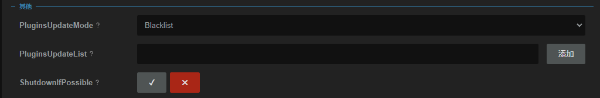
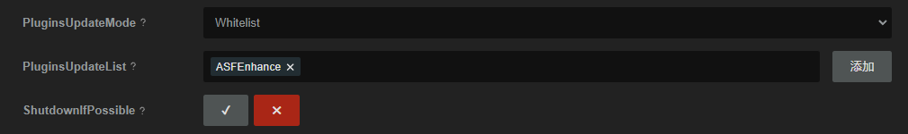

# ASFEnhance


[](https://www.codacy.com/gh/chr233/ASFEnhance/dashboard)

[](https://github.com/chr233/ASFEnhance/blob/master/license)
[](https://crowdin.com/project/asfenhance)

[](https://github.com/chr233/ASFEnhance/releases)
[](https://github.com/chr233/ASFEnhance/releases)


[](https://img.shields.io/github/v/release/chr233/ASFEnhance)

[](https://space.bilibili.com/5805394)
[](https://steamcommunity.com/id/Chr_)

[](https://steamcommunity.com/tradeoffer/new/?partner=221260487&token=xgqMgL-i)
[![爱发电][afdian_img]][afdian_link]
[![buy me a coffee][bmac_img]][bmac_link]

[English Version](README.en.md) | [Русская Версия](README.ru.md)

ASFEnhance 介绍 & 使用指南: [https://keylol.com/t804841-1-1](https://keylol.com/t804841-1-1)

## EULA

> 请不要使用本插件来进行不受欢迎的行为, 包括但不限于: 刷好评, 发布广告 等.
>
> 详见 [插件配置说明](#插件配置说明)

## 限时活动 EVENT

> 本组命令具有时效性, 仅能在特定时间内使用, 失效的命令将会在插件的下一个版本中被移除

| 命令                   | 缩写  |    权限    | 说明                                                                                                           |
| ---------------------- | :---: | :--------: | -------------------------------------------------------------------------------------------------------------- |
| `CLAIMITEM [Bots]`     | `CI`  | `Operator` | 获取促销活动的奖励物品(比如贴纸)                                                                               |
| `CLAIM20TH [Bots]`     | `C20` | `Operator` | 领取点数商店中 20 周年免费物品                                                                                 |
| `DL2 [Bots]`           |       | `Operator` | 获取 `Dying Light 2 Stay Human` 个人资料装饰品 [url](https://store.steampowered.com/sale/dyinglight2towerraid) |
| `VOTE [Bots] <AppIds>` |  `V`  | `Operator` | 为 `STEAM 大奖` 投票, AppIds 最多指定 10 个游戏, 未指定或 AppIds 不足 11 个时不足部分将使用内置 AppId 进行投票 |
| `CHECKVOTE [Bots]`     | `CV`  | `Operator` | 获取 `STEAM 大奖` 徽章任务完成情况                                                                             |

> `ASFEnhance` 将会在启动 1 小时后的每 23 小时, 为 `AutoClaimItemBotNames` 中设置的机器人, 执行 `CLAIMITEM` 命令

## 安装方式

### 初次安装 / 手动更新

1. 从 [GitHub Releases](https://github.com/chr233/ASFEnhance/releases) 下载插件的最新版本
2. 解压后将 `ASFEnhance.dll` 丢进 `ArchiSteamFarm` 目录下的 `plugins` 文件夹
3. 重新启动 `ArchiSteamFarm` , 使用命令 `ASFEnhance` 或 `ASFE` 来检查插件是否正常工作

### 子模块

> ASFEnhance 2.0.0.0 之后, 增加了子模块系统, 可以管理并更新受支持的插件

受支持的插件列表:

- [ASFMultipleProxy](https://github.com/chr233/ASFMultipleProxy)
- [ASFBuffBot](https://github.com/chr233/ASFBuffBot)
- [ASFOAuth](https://github.com/chr233/ASFOAuth)
- [ASFTradeExtension](https://github.com/chr233/ASFTradeExtension)
- [ASFAchievementManagerEx](https://github.com/chr233/ASFAchievementManagerEx) (Bugfix WIP)
- [ASFAwardTool](https://afdian.com/item/8caab3b0105411ef83c75254001e7c00)
- ...

> 接入示例插件: [ASFEnhanceAdapterDemoPlugin](https://github.com/chr233/ASFEnhanceAdapterDemoPlugin)

### 插件更新 & 子模块更新

> ArchiSteamFarm 6.0.0.0 后新增插件更新接口, 可以通过 ASF 更新插件

更新插件命令: `UPDATEPLUGINS stable ASFEnhance`

---

> 也可以使用 `Update` 命令更新, 需要将 `ASF.json` 中的 `PluginsUpdateMode` 设置为 `blacklist`



> 或者 `PluginsUpdateMode` 设置为 `whitelist`, 并将 `ASFEnhance` 添加到 `PluginsUpdateList` 中



---

| 命令                      | 缩写 | 权限       | 说明                                                                 |
| ------------------------- | ---- | ---------- | -------------------------------------------------------------------- |
| `PLUGINSLIST`             | `PL` | `Operator` | 获取当前安装的插件列表, 末尾带 [] 的为可被 ASFEnhance 管理的子模块   |
| `PLUGINLIST`              | -    | `Operator` | 同 `PLUGINSLIST`                                                     |
| `PLUGINSVERSION [插件名]` | `PV` | `Master`   | 获取指定模块的版本信息, 未指定插件名时检查所有受支持的插件的版本信息 |
| `PLUGINVERSION`           | -    | `Master`   | 同 `PLUGINSVERSION`                                                  |
| `PLUGINSUPDATE [插件名]`  | `PU` | `Master`   | 自动更新指定模块, 未指定插件名时自动更新所有受支持的插件             |
| `PLUGINUPDATE`            | -    | `Master`   | 同 `PLUGINSUPDATE`                                                   |

### 捐赠

|               ![img][afdian_qr]                |                   ![img][bmac_qr]                   |                       ![img][usdt_qr]                       |
| :--------------------------------------------: | :-------------------------------------------------: | :---------------------------------------------------------: |
| ![爱发电][afdian_img] <br> [链接][afdian_link] | ![buy me a coffee][bmac_img] <br> [链接][bmac_link] | ![USDT][usdt_img] <br> `TW41eecZ199QK6zujgKP4j1cz2bXzRus3c` |

[afdian_qr]: https://raw.chrxw.com/chr233/master/afadian_qr.png
[afdian_img]: https://img.shields.io/badge/爱发电-@chr__-ea4aaa.svg?logo=github-sponsors
[afdian_link]: https://afdian.com/@chr233
[bmac_qr]: https://raw.chrxw.com/chr233/master/bmc_qr.png
[bmac_img]: https://img.shields.io/badge/buy%20me%20a%20coffee-@chr233-yellow?logo=buymeacoffee
[bmac_link]: https://www.buymeacoffee.com/chr233
[usdt_qr]: https://raw.chrxw.com/chr233/master/usdt_qr.png
[usdt_img]: https://img.shields.io/badge/USDT-TRC20-2354e6.svg?logo=bitcoin

### 更新日志

| ASFEnhance 版本                                                        | 适配 ASF 版本 | 更新说明                                                              |
| ---------------------------------------------------------------------- | :-----------: | --------------------------------------------------------------------- |
| [2.3.3.0](https://github.com/chr233/ASFEnhance/releases/tag/2.3.3.0)   |    6.1.1.3    | ASF -> 6.1.1.3                                                        |
| [2.3.2.1](https://github.com/chr233/ASFEnhance/releases/tag/2.3.2.1)   |    6.1.0.3    | 适配冬促投票, 优化 REPLAY 命令                                        |
| [2.3.2.0](https://github.com/chr233/ASFEnhance/releases/tag/2.3.2.0)   |    6.1.0.3    | ASF -> 6.1.0.3                                                        |
| [2.3.1.1](https://github.com/chr233/ASFEnhance/releases/tag/2.3.1.1)   |    6.1.0.2    | ASF -> 6.1.0.2                                                        |
| [2.3.0.1](https://github.com/chr233/ASFEnhance/releases/tag/2.3.0.1)   |    6.1.0.1    | ASF -> 6.1.0.1                                                        |
| [2.2.9.0](https://github.com/chr233/ASFEnhance/releases/tag/2.2.9.0)   |    6.0.8.7    | 修改 `EXPLORER` 命令                                                  |
| [2.2.8.0](https://github.com/chr233/ASFEnhance/releases/tag/2.2.8.0)   |    6.0.8.7    | 新增 `VOTE`, `CHECKVOTE` 命令                                         |
| [2.2.7.0](https://github.com/chr233/ASFEnhance/releases/tag/2.2.7.0)   |    6.0.8.7    | 新增 `MYBAN` 命令                                                     |
| [2.2.6.0](https://github.com/chr233/ASFEnhance/releases/tag/2.2.6.0)   |    6.0.8.7    | ASF -> 6.0.8.7                                                        |
| [2.2.5.0](https://github.com/chr233/ASFEnhance/releases/tag/2.2.5.0)   |    6.0.7.5    | 新增 `ADDFUNDS` 命令                                                  |
| [2.2.4.0](https://github.com/chr233/ASFEnhance/releases/tag/2.2.4.0)   |    6.0.7.5    | ASF -> 6.0.7.5                                                        |
| [2.2.3.3](https://github.com/chr233/ASFEnhance/releases/tag/2.2.3.3)   |    6.0.6.4    | ASF -> 6.0.6.4, 兼容非 generic                                        |
| [2.2.1.1](https://github.com/chr233/ASFEnhance/releases/tag/2.2.1.1)   |    6.0.5.2    | 新增 `NOTIFICATION` 命令, bugfix                                      |
| [2.2.1.1](https://github.com/chr233/ASFEnhance/releases/tag/2.2.1.1)   |    6.0.5.2    | 新增 `NOTIFICATION` 命令, bugfix                                      |
| [2.2.0.1](https://github.com/chr233/ASFEnhance/releases/tag/2.2.0.1)   |    6.0.5.2    | ASF -> 6.0.5.2, 改进翻译                                              |
| [2.1.12.0](https://github.com/chr233/ASFEnhance/releases/tag/2.1.12.0) |    6.0.4.4    | 改进翻译, 新增 `IGNOREGAME` 命令                                      |
| [2.1.11.0](https://github.com/chr233/ASFEnhance/releases/tag/2.1.11.0) |    6.0.4.4    | 改进翻译, 新增 `REGISTEDATE` 命令                                     |
| [2.1.10.3](https://github.com/chr233/ASFEnhance/releases/tag/2.1.10.3) |    6.0.4.4    | ASF -> 6.0.4.4, 改进翻译, 新增 `CRAFTSPECIFYBADGES` 命令              |
| [2.1.9.2](https://github.com/chr233/ASFEnhance/releases/tag/2.1.9.2)   |    6.0.3.4    | 新增 `DL2` 命令, 移除失效命令                                         |
| [2.1.8.3](https://github.com/chr233/ASFEnhance/releases/tag/2.1.8.3)   |    6.0.3.4    | 新增 `STACKINVENTORY`, `UNSTACKINVENTORY` 命令                        |
| [2.1.7.1](https://github.com/chr233/ASFEnhance/releases/tag/2.1.7.1)   |    6.0.3.4    | 新增 `CHECKMARKLIMIT` 命令                                            |
| [2.1.6.0](https://github.com/chr233/ASFEnhance/releases/tag/2.1.6.0)   |    6.0.3.4    | ASF -> 6.0.3.4                                                        |
| [2.1.5.0](https://github.com/chr233/ASFEnhance/releases/tag/2.1.5.0)   |    6.0.2.6    | 修复 `GETACCCOUNTBAN` 命令, 新增 `DELETECART` 命令                    |
| [2.1.4.0](https://github.com/chr233/ASFEnhance/releases/tag/2.1.4.0)   |    6.0.2.6    | ASF -> 6.0.2.6, 修复 `ADDWISHLIST` 命令                               |
| [2.1.3.3](https://github.com/chr233/ASFEnhance/releases/tag/2.1.3.3)   |   6.0.1.24    | ASF -> 6.0.1.24, 修复 `ADDWISHLIST` 命令, 新增 `GETPRIVACYAPP` 等命令 |
| [2.1.2.3](https://github.com/chr233/ASFEnhance/releases/tag/2.1.2.3)   |    6.0.0.3    | 修复 `PURCHASE` 命令, 新增 `RECOMMENT` 命令                           |
| [2.1.1.1](https://github.com/chr233/ASFEnhance/releases/tag/2.1.1.1)   |    6.0.0.3    | ASF -> 6.0.0.3                                                        |

[更早的版本](#历史版本)

## 插件配置说明

> 本插件的配置不是必须的, 保持默认配置即可使用大部分功能

### ASF.json

```json
{
  //ASF 配置
  "CurrentCulture": "...",
  "IPCPassword": "...",
  "...": "...",
  //ASFEnhance 配置
  "ASFEnhance": {
    "EULA": true,
    "Statistic": true,
    "DevFeature": false,
    "DisabledCmds": ["foo", "bar"],
    "AutoClaimItemBotNames": "",
    "AutoClaimItemPeriod": 23,
    "ApiKey": "",
    "DefaultLanguage": "",
    "CustomGifteeMessage": "",
    "Address": {
      "Address": "Address",
      "City": "City",
      "Country": "US",
      "State": "NE",
      "PostCode": "12345"
    },
    "Addresses": [
      {
        "Address": "Address",
        "City": "City",
        "Country": "US",
        "State": "NE",
        "PostCode": "12345"
      }
    ]
  }
}
```

| 配置项                  | 类型     | 默认值  | 说明                                                                                                               |
| ----------------------- | -------- | ------- | ------------------------------------------------------------------------------------------------------------------ |
| `EULA`                  | `bool`   | `true`  | 是否同意 [EULA](#EULA)\*                                                                                           |
| `Statistic`             | `bool`   | `true`  | 是否允许发送统计数据, 仅用于统计插件用户数量, 不会发送任何其他信息                                                 |
| `DevFeature`            | `bool`   | `false` | 是否启用开发者特性 (一共 3 条命令) `具有一定安全风险, 请谨慎开启`                                                  |
| `DisabledCmds`          | `list`   | `null`  | 可选配置, 在此列表中的命令将会被禁用\*\* , **不区分大小写**, 仅对 `ASFEnhance` 中的命令生效                        |
| `Address`\*\*\*         | `dict`   | `null`  | 可选配置, 单个账单地址, 使用 `REDEEMWALLET` 命令激活钱包兑换码如果要求设置账单地址时自动使用                       |
| `Addresses`\*\*\*       | `list`   | `null`  | 可选配置, 多个账单地址, 需要账单地址时从列表中随机使用一个                                                         |
| `AutoClaimItemBotNames` | `string` | `null`  | 可选配置, 自动领取物品的机器人名称, 用" "或者","分隔多个机器人, 例如 `bot1 bot2,bot3`, 也支持 `ASF` 指代所有机器人 |
| `AutoClaimItemPeriod`   | `uint`   | `23`    | 可选配置, 自动领取物品的周期, 单位小时                                                                             |
| `ApiKey`                | `string` | `null`  | 可选配置, 用于 `GETACCOUNTBAN` 等相关命令, 查询封禁记录                                                            |
| `DefaultLanguage`       | `string` | `null`  | 可选配置, 自定义 `PUBLISHRECOMMENT` 发布评测时使用的语言, 默认为机器人账户区域域                                   |
| `CustomGifteeMessage`   | `string` | `null`  | 可选配置, 赠送礼物时的留言                                                                                         |

> \* 同意 [EULA](#EULA) 后, ASFEnhance 将会开放全部命令, 作为交换, ASFEnhance 会在执行 `GROUPLIST` 和 `CURATORLIST`
> 时自动关注作者的[鉴赏家](https://steamcommunity.com/groups/11012580/curation)
> 和[组](https://steamcommunity.com/groups/11012580) (如果尚未关注的话)
>
> \* 禁用 [EULA](#EULA) 后, ASFEnhance 将会限制使用 鉴赏家/群组/评测 等功能, 同时 ASFEnhance
> 也不会主动关注[鉴赏家](https://steamcommunity.com/groups/11012580/curation)
> 和[组](https://steamcommunity.com/groups/11012580)
>
> \*\* `DisabledCmds` 配置说明: 该项配置**不区分大小写**, 仅对 `ASFEnhance` 中的命令有效
> 例如配置为 `["foo","BAR"]` , 则代表 `FOO` 和 `BAR` 命令将会被禁用
> 如果无需禁用任何命令, 请将此项配置为 `null` 或者 `[]`
> 当某条命令被禁用时, 仍然可以使用 `ASFE.xxx` 的形式调用被禁用的命令, 例如 `ASFE.EXPLORER`
>
> \*\*\* `Address` 与 `Addresses` 为同一个配置项, 如果需要使用定区功能 , 仅配置一个即可, 不需要都配置, 如果不需要这个功能也可以不配置

### Bot.json

```json
{
  //机器人配置
  "Enabled": true,
  "SteamLogin": "",
  "SteamPassword": "",
  "...": "...",
  //ASFEnhance配置
  "UserCountry": "CN"
}
```

| 配置项        | 类型     | 默认值 | 说明                                                                                   |
| ------------- | -------- | ------ | -------------------------------------------------------------------------------------- |
| `UserCountry` | `string` | `null` | 为机器人指定国家代码, 影响购物车相关命令, 未指定时插件会根据机器人钱包货币选择国家代码 |

> 请注意!!
> 一般来说无需设置 `UserCountry` 字段, 插件可以根据账户钱包自动获取国家代码
> 如果设置了无效的 `UserCountry` 字段, 可能会导致无法添加购物车
> 当且仅当账号钱包为 `EUR` 导致无法转换为正确的国家代码, 或者添加购物车时提示网络错误, 才需要修改此字段

## 插件指令说明

### 插件测试

| 命令         | 缩写   | 权限            | 说明                   |
| ------------ | ------ | --------------- | ---------------------- |
| `ASFENHANCE` | `ASFE` | `FamilySharing` | 查看 ASFEnhance 的版本 |

### 账号相关

| 命令                                      | 缩写    | 权限       | 说明                                                                                            |
| ----------------------------------------- | ------- | ---------- | ----------------------------------------------------------------------------------------------- |
| `PURCHASEHISTORY [Bots]`                  | `PH`    | `Operator` | 读取商店消费历史记录                                                                            |
| `FREELICENSES [Bots]`                     | `FL`    | `Operator` | 读取账户中的免费 Sub License 列表                                                               |
| `FREELICENSE [Bots]`                      |         |            | 同 `FREELICENSES`                                                                               |
| `LICENSES [Bots]`                         | `L`     | `Operator` | 读取账户中的所有 License 列表                                                                   |
| `LICENSE [Bots]`                          |         |            | 同 `LICENSES`                                                                                   |
| `REMOVEDEMOS [Bots]`                      | `RD`    | `Master`   | 移除账户中所有的 Demo License                                                                   |
| `REMOVEDEMO [Bots]`                       |         |            | 同 `REMOVEDEMOS`                                                                                |
| `REMOVELICENSES [Bots] <SubIDs>`          | `RL`    | `Master`   | 移除账户中指定的 Sub License                                                                    |
| `REMOVELICENSE [Bots] <SubIDs>`           |         |            | 同 `REMOVELICENSES`                                                                             |
| `EMAILIOPTIONS [Bots]`                    | `EO`    | `Operator` | 读取账户中的电子邮件偏好选项 [url](https://store.steampowered.com/account/emailoptout)          |
| `EMAILIOPTION [Bots]`                     |         |            | 同 `EMAILOPTIONS`                                                                               |
| `SETEMAILOPTIONS [Bots] <Options>`        | `SEO`   | `Master`   | 设置账户中的电子邮件偏好选项                                                                    |
| `SETEMAILOPTION [Bots] <Options>`         |         |            | 同 `SETEMAILOPTIONS`                                                                            |
| `NOTIFICATIONOPTIONS [Bots]`              | `NOO`   | `Operator` | 读取账户中的通知选项 [url](https://store.steampowered.com/account/notificationsettings)         |
| `NOTIFICATIONOPTION [Bots]`               |         |            | 同 `NOTIFICATIONOPTIONS`                                                                        |
| `SETNOTIFICATIONOPTIONS [Bots] <Options>` | `SNOO`  | `Master`   | 设置账户中的通知选项                                                                            |
| `SETNOTIFICATIONOPTION [Bots] <Options>`  |         |            | 同 `SETNOTIFICATIONOPTIONS`                                                                     |
| `GETBOTBANNED [Bots]`                     | `GBB`   | `Operator` | 获取机器人的账户封禁情况                                                                        |
| `GETBOTBANN [Bots]`                       |         |            | 同 `GETBOTBANNED`                                                                               |
| `GETACCOUNTBANNED <SteamIds>`             | `GBB`   | `Operator` | 获取指定账户封禁情况, 支持 SteamId 64 / SteamId 32 ⚠️ 由于 ASF 改动, 需要设置 ApiKey 后才能使用 |
| `GETACCOUNTBAN <SteamIds>`                |         |            | 同 `GETACCOUNTBANNED`                                                                           |
| `EMAIL [Bots]`                            | `EM`    | `Operator` | 获取账户电子邮件                                                                                |
| `CHECKAPIKEY [Bots]`                      |         | `Operator` | 检查 ApiKey 是否存在                                                                            |
| `REVOKEAPIKEY [Bots]`                     |         | `Master`   | 吊销当前 ApiKey                                                                                 |
| `GETPRIVACYAPP [Bots]`                    | `GPA`   | `Operator` | 获取私密 APP 列表                                                                               |
| `SETAPPPRIVATE [Bots] <AppIds>`           | `SAPRI` | `Master`   | 将指定 APP 设置为私密                                                                           |
| `SETAPPPUBLIC [Bots] <AppIds>`            | `SAPUB` | `Master`   | 将指定 APP 设置为公开                                                                           |
| `CHECKMARKETLIMIT [Bots]`                 | `CML`   | `Operator` | 检查机器人的市场交易权限是否被限制                                                              |
| `REGISTEDATE [Bots]`                      |         | `Operator` | 获取机器人注册时间                                                                              |
| `MYBAN [Bots]`                            |         | `Operator` | 获取当前机器人账户受到封禁的游戏列表                                                            |

- `SETEMAILOPTIONS` 参数说明

  `<Options>` 参数接受最多 9 个参数, 使用空格或者 `,` 分隔,
  顺序参照 [url](https://store.steampowered.com/account/emailoptout)
  如果参数为 `on`, `yes`, `true`, `1`, `y` 则视为开启, 否则视为禁用(默认)

| 索引 | 名称                                               | 说明                     |
| ---- | -------------------------------------------------- | ------------------------ |
| 1    | 是否启用电子邮件通知                               | 禁用后其余选项均不起作用 |
| 2    | 愿望单物品打折时发送邮件通知                       |                          |
| 3    | 愿望单物品发行或脱离抢先体验时发送邮件通知         |                          |
| 4    | 关注的青睐之光物品发行或脱离抢先体验时发送邮件通知 |                          |
| 5    | 关注的发行商发行或者脱离抢险体验时发送邮件通知     |                          |
| 6    | 当季节促销开始时发送邮件通知                       |                          |
| 7    | 收到鉴赏家评测副本时发送邮件通知                   |                          |
| 8    | 收到社区奖励时发送邮件通知                         |                          |
| 9    | 收到游戏活动通知时发送邮件通知                     |                          |

- `SETNOTIFICATIONS` 参数说明

  `<Options>` 参数接受最多 9 个参数, 使用空格或者 `,` 分隔,
  顺序参照 [url](https://store.steampowered.com/account/notificationsettings)
  索引含义和设置值可选的范围见下表

| 索引 | 名称                      |
| ---- | ------------------------- |
| 1    | 我收到了礼物              |
| 2    | 我订阅的讨论区有回复      |
| 3    | 我库存中收到了新物品      |
| 4    | 我收到了好友邀请          |
| 5    | 有大型特卖                |
| 6    | 愿望单中的某件物品有折扣  |
| 7    | 我收到了一个新的交易报价  |
| 8    | 我收到了 Steam 客服的回复 |
| 9    | 我收到了 Steam 回合通知   |

| 设置值 | 含义                                             |
| ------ | ------------------------------------------------ |
| 0      | 关闭通知                                         |
| 1      | 启用通知                                         |
| 2      | 启用通知, Steam 客户端弹出通知                   |
| 3      | 启用通知, 手机应用推送通知                       |
| 4      | 启用通知, Steam 客户端弹出通知, 手机应用推送通知 |

### 其他功能

| 命令             | 缩写    | 权限            | 说明             |
| ---------------- | ------- | --------------- | ---------------- |
| `KEY <Text>`     | `K`     | `FamilySharing` | 从文本提取 key   |
| `ASFEHELP`       | `EHELP` | `FamilySharing` | 查看全部指令说明 |
| `HELP <Command>` | -       | `FamilySharing` | 查看指令说明     |

### 群组相关

| 命令                           | 缩写 | 权限            | 说明                 |
| ------------------------------ | ---- | --------------- | -------------------- |
| `GROUPLIST [Bots]`             | `GL` | `FamilySharing` | 查看机器人的群组列表 |
| `JOINGROUP [Bots] <GroupName>` | `JG` | `Master`        | 加入指定群组         |
| `LEAVEGROUP [Bots] <GroupID>`  | `LG` | `Master`        | 离开指定群组         |

> `GroupID`可以用命令`GROUPLIST`获取

### 个人资料相关

| 命令                                   | 缩写  | 权限            | 说明                                                                                                  |
| -------------------------------------- | ----- | --------------- | ----------------------------------------------------------------------------------------------------- |
| `PROFILE [Bots]`                       | `PF`  | `FamilySharing` | 查看个人资料                                                                                          |
| `PROFILELINK [Bots]`                   | `PFL` | `FamilySharing` | 查看个人资料链接                                                                                      |
| `STEAMID [Bots]`                       | `SID` | `FamilySharing` | 查看 steamID                                                                                          |
| `FRIENDCODE [Bots]`                    | `FC`  | `FamilySharing` | 查看好友代码                                                                                          |
| `TRADELINK [Bots]`                     | `TL`  | `Operator`      | 查看交易链接                                                                                          |
| `REPLAY [Year] [Bots]`                 | `RP`  | `Operator`      | 获取摘要图片链接 (可以解锁徽章) , 使用 2 个及以上参数时第一个参数视为指定年份, 比如 `Replay 2022 bot` |
| `REPLAYPRIVACY [Year] [Bots] Privacy`  | `RPP` | `Operator`      | 设置年度总结可见性, `Privacy` 1=私密 2=好友可见 3=公开 , 使用 3 个及以上参数时第一个参数视为指定年份  |
| `CLEARALIAS [Bots]`                    |       | `Opetator`      | 清除曾用名                                                                                            |
| `GAMEAVATAR [Bots] <AppID> [AvatarID]` | `GA`  | `Master`        | 根据指定 `AppID` 和 `AvatarID` 设置机器人的头像, 省略 `AvatarId` 时将随机选择头像                     |
| `RANDOMGAMEAVATAR [Bots]`              | `RGA` | `Master`        | 设置机器人的头像为随机游戏头像                                                                        |
| `ADVNICKNAME [Bots] Query`             | `ANN` | `Master`        | 使用 `占位符` 设置机器人昵称, 可用占位符 `%dn%` `%ln%` `%un%` `%botn%` 不区分大小写                   |
| `SETAVATAR [Bots] ImageUrl` 🐞\*       | `GA`  | `Master`        | 设置机器人的头像为指定网络图片                                                                        |
| `DELETEAVATAR [Bots]` 🐞\*             |       | `Master`        | 删除机器人的头像(设置为默认头像)                                                                      |
| `CRAFTBADGE [Bots]`                    | `CB`  | `Master`        | 自动合成可合成徽章 (每个可升级徽章合成一级)                                                           |
| `CRAFTSPECIFYBADGES [Bots] <AppIds>`   | `CSB` | `Master`        | 自动合成指定游戏的徽章 (各合成一级)                                                                   |
| `EDITCUSTOMURL [Bot] CustomUrl`        | `ECU` | `Master`        | 修改自定义个人资料链接                                                                                |
| `DELETECUSTOMURL [Bots]`               | `DCU` | `Master`        | 删除自定义个人资料链接                                                                                |

\*🐞: 需要使用 generic 版本的 ASF (**非** generic-netf)

- GAMEAVATAR 使用说明

头像来自 [Game Avatars Page](https://steamcommunity.com/actions/GameAvatars/)

---

- ADVNICKNAME Query 参数说明

> 数字可以任意指定

| 占位符   | 说明                  | 示例结果                   |
| -------- | --------------------- | -------------------------- |
| `%d%`    | 随机数字              | `5`                        |
| `%dn%`   | n 位随机数字          | `%d6%` -> `114514`         |
| `%l%`    | 随机小写字母          | `x`                        |
| `%ln%`   | n 位小写字母          | `%d7%` -> `asfeadf`        |
| `%u%`    | 随机大写字母          | `C`                        |
| `%un%`   | n 位随机大写字母      | `%d8%` -> `ASXCGDFA`       |
| `%bot%`  | 机器人昵称            | `ASFE`                     |
| `%bot3%` | 机器人昵称, 重复 3 次 | `%bot3%` -> `ASFEASFEASFE` |

### 鉴赏家相关

| 命令                             | 缩写    | 权限     | 说明                     |
| -------------------------------- | ------- | -------- | ------------------------ |
| `CURATORLIST [Bots]`             | `CL`    | `Master` | 查看已关注的鉴赏家列表   |
| `FOLLOWCURATOR [Bots] <ClanIDs>` | `FCU`   | `Master` | 关注指定鉴赏家           |
| `UNFOLLOWCURATOR [Bots]`         | `UFCU`  | `Master` | 取消关注指定鉴赏家       |
| `UNFOLLOWALLCURATORS [Bots]`     | `UFACU` | `Master` | 取消关注所有鉴赏家       |
| `UNFOLLOWALLCURATOR [Bots]`      |         |          | 同 `UNFOLLOWALLCURATORS` |

### 愿望单相关

| 命令                               | 缩写  | 权限     | 说明                    |
| ---------------------------------- | ----- | -------- | ----------------------- |
| `ADDWISHLIST [Bots] <AppIDs>`      | `AW`  | `Master` | 添加愿望单              |
| `REMOVEWISHLIST [Bots] <AppIDs>`   | `RW`  | `Master` | 移除愿望单              |
| `FOLLOWGAME [Bots] <AppIDs>`       | `FG`  | `Master` | 关注游戏                |
| `UNFOLLOWGAME [Bots] <AppIDs>`     | `UFG` | `Master` | 取消关注游戏            |
| `CHECK [Bots] <AppIDs>`            | `CK`  | `Master` | 检查游戏关注/愿望单情况 |
| `IGNOREGAME [Bots] <AppIDs>`       | `IG`  | `Master` | 忽略游戏                |
| `REMOVEIGNOREGAME [Bots] <AppIDs>` | `RIG` | `Master` | 取消忽略游戏            |

### 商店相关

| 命令                                           | 缩写   | 权限       | 说明                                                  |
| ---------------------------------------------- | ------ | ---------- | ----------------------------------------------------- |
| `APPDETAIL [Bots] <AppIDs\|SubIDs\|BundleIds>` | `AD`   | `Operator` | 获取 APP 信息, 无法获取锁区游戏信息                   |
| `SUBS`                                         | `S`    | `Operator` | 同 `APPDETAIL`                                        |
| `SEARCH [Bots] Keywords`                       | `SS`   | `Operator` | 搜索商店                                              |
| `PUBLISHRECOMMENT [Bots] <AppIDs> COMMENT`     | `PREC` | `Master`   | 发布评测, `APPID` 或 `+APPID` 给好评, `-AppID` 给差评 |
| `DELETERECOMMENT [Bots] <AppIDs>`              | `DREC` | `Master`   | 删除评测                                              |
| `RECOMMENT [Bots] <AppIDs>`                    | `REC`  | `Master`   | 获取评测内容                                          |
| `REQUESTACCESS [Bots] <AppIDs>`                | `RA`   | `Operator` | 请求游戏内测访问权限, 等效于点击 `请求访问权限`       |
| `VIEWPAGE [Bots] Url`                          | `VP`   | `Operator` | 访问指定页面                                          |
| `REDEEMPOINTSITEM [Bots] <defIds>`             | `RPI`  | `Master`   | 兑换点数商店物品                                      |
| `REDEEMPOINTITEM [Bots] <defIds>`              |        | `Master`   | 同 `REDEEMPOINTSITEM`                                 |
| `REDEEMPOINTSBADGE [Bots] defId level`         | `RPB`  | `Master`   | 兑换点数商店季节徽章                                  |
| `REDEEMPOINTBADGE  [Bots] defId level`         |        | `Master`   | 同`REDEEMPOINTSBADGE`                                 |

> defId 可以从 SteamDB 查到, 比如 `Winter Collection - 2023` 季节徽章的 defId 为 `258511`,
> 可以在这个 [链接](https://steamdb.info/app/2750340/communityitems/#item-class-1-data) 查到

### 购物车相关

> STEAM 的购物车储存在 Cookies 里,重启 ASF 将会导致购物车清空

| 命令                                             | 缩写  | 权限       | 说明                                                                                  |
| ------------------------------------------------ | ----- | ---------- | ------------------------------------------------------------------------------------- |
| `CART [Bots]`                                    | `C`   | `Operator` | 查看机器人购物车                                                                      |
| `ADDCART [Bots] <SubIDs\|BundleIDs>`             | `AC`  | `Operator` | 添加购物车, 仅能使用`SubID`和`BundleID`, 例如 `s/1234, b/1234` 如果省略前缀视为 subId |
| `ADDCARTPRIVATE [Bots] <SubIDs\|BundleIDs>`      | `ACP` | `Operator` | 添加购物车, 设置为私密购买                                                            |
| `ADDCARTGIFT [Bots] <SubIDs\|BundleIDs> SteamId` | `ACG` | `Operator` | 添加购物车, 设置为礼物赠送, SteamId 支持 botName 或者 SteamID32 或者 SteamId64        |
| `EDITCART [Bots] <lineItemIds>`                  | `EC`  | `Operator` | 编辑购物车项目, 设置为为自己购买                                                      |
| `EDITCARTPRIVATE [Bots] <lineItemIds>`           | `ECP` | `Operator` | 编辑购物车项目, 设置为私密购买                                                        |
| `EDITCARTGIFT [Bots] <lineItemIds> SteamId`      | `ECG` | `Operator` | 编辑购物车项目, 设置为礼物赠送, SteamId 支持 botName 或者 SteamID32 或者 SteamId64    |
| `DELETECART [Bots] <lineItemIds>`                | `DC`  | `Operator` | 删除购物车项目                                                                        |
| `CARTRESET [Bots]`                               | `CR`  | `Operator` | 清空购物车                                                                            |
| `CARTCOUNTRY [Bots]`                             | `CC`  | `Operator` | 获取购物车可用结算区域(跟账号钱包和当前 IP 所在地有关)                                |
| `FAKEPURCHASE [Bots]`                            | `FPC` | `Master`   | 模拟结算机器人的购物车, 生成一条购买失败的记录, 不会真的结账                          |
| `PURCHASE [Bots]`                                | `PC`  | `Master`   | 结算机器人的购物车, 只能为机器人自己购买 (使用 Steam 钱包余额结算)                    |
| `ADDFUNDS [Bots] Amount`                         |       | `Operator` | 为机器人钱包充值余额, 结算单位由机器人钱包决定, 返回外部支付链接                      |

> Steam 允许重复购买,使用 `PURCHASE` 命令前请自行确认有无重复内容

### 社区相关

| 命令                       | 缩写 | 权限       | 说明                              |
| -------------------------- | ---- | ---------- | --------------------------------- |
| `NOTIFICATION [Bots]`      | `N`  | `Operator` | 查看通知列表, 前缀`*`代表未读通知 |
| `CLEARNOTIFICATION [Bots]` | `CN` | `Operator` | 将所有通知标记为已读              |

### 好友相关

| 命令                           | 缩写  | 权限       | 说明                                                                              |
| ------------------------------ | ----- | ---------- | --------------------------------------------------------------------------------- |
| `ADDBOTFRIEND <Bots>`          | `ABF` | `Master`   | 让`Bots`互相添加为好友                                                            |
| `ADDBOTFRIEND <BotAs>+<BotBs>` |       | `Master`   | 让`BotAs`互相添加为好友, 并且让`BotAs`添加`BotsBs`为好友                          |
| `ADDFRIEND [Bots] <Text>`      | `AF`  | `Master`   | 让机器人发送好友请求, `Text` 支持 `自定义链接`, `SteamId`, `好友代码`, `邀请链接` |
| `DELETEFRIEND [Bots] <Text>`   | `DF`  | `Master`   | 删除指定好友, `Text` 支持 `自定义链接`, `SteamId`, `好友代码`                     |
| `DELETEALLFRIEND [Bots]`       |       | `Master`   | 删除所有好友                                                                      |
| `INVITELINK [Bots]`            | `IL`  | `Operator` | 生成好友邀请链接                                                                  |

- `ADDBOTFRIEND` 参数示例
  - `ADDBOTFRIEND a,b c`: 让`a`,`b`,`c`互相添加好友
  - `ADDBOTFRIEND a,b,c + d,e`: 让`a`,`b`,`c`互相添加好友, 然后让`a`,`b`,`c`分别添加`d`,`e`为好友, `d`不会添加`e`为好友
  - `ADDBOTFRIEND ASF`: 允许使用通配符
  - `ADDBOTFRIEND a b c + ASF`: 允许使用通配符
  - `ADDBOTFRIEND ASF + ASF`: 允许使用, 但是没有意义

### 探索队列

| 命令              | 缩写 | 权限     | 说明             |
| ----------------- | ---- | -------- | ---------------- |
| `EXPLORER [Bots]` | `EX` | `Master` | 执行探索队列任务 |

### 钱包相关

| 命令                             | 缩写   | 权限     | 说明                                                           |
| -------------------------------- | ------ | -------- | -------------------------------------------------------------- |
| `REDEEMWALLET [Bots] <keys>`     | `RWA`  | `Master` | 兑换钱包充值码, 如果需要提供地址信息则自动填入配置文件中的地址 |
| `REDEEMWALLETMULT [Bots] <keys>` | `RWAM` | `Master` | 批量兑换钱包充值码, 但是每个机器人只会兑换一个 `key`           |

## 物品库存

> 物品堆叠和取消堆叠会发送大量请求, 请不要对大量机器人同时使用这些命令, 有可能会因为网络请求过多导致临时封禁

| 命令                                      | 缩写   | 权限       | 说明                                                                                |
| ----------------------------------------- | ------ | ---------- | ----------------------------------------------------------------------------------- |
| `STACKINVENTORY [Bots] AppId ContextId`   | `STI`  | `Operator` | 将指定 AppId 的物品库存中同类物品堆叠在一起, 对于大部分 App 来说, `ContextId` = 2   |
| `UNSTACKINVENTORY [Bots] AppId ContextId` | `USTI` | `Operator` | 将指定 AppId 的物品库存中堆叠后的物品解除堆叠, 对于大部分 App 来说, `ContextId` = 2 |
| `PENDINGGIFT [Bots]`                      | `PG`   | `Operator` | 查看待接收礼物列表                                                                  |
| `ACCEPTGIFT [Bots] <GiftIds>`             | `AG`   | `Master`   | 接收指定礼物, GiftId 可指定为 `*`, 代表所有礼物                                     |
| `DECLINEGIFT [Bots] <GiftIds>`            | `DG`   | `Master`   | 拒绝指定礼物, GiftId 可指定为 `*`, 代表所有礼物                                     |
| `TRADEOFFERS [Bots]`                      | `TO`   | `Operator` | 查看待处理的交易报价列表                                                            |
| `ACCEPTOFFER [Bots] <OfferIds>`           | `AO`   | `Master`   | 接收指定报价, OfferId 可指定为 `*`, 代表所有报价                                    |
| `CANCELOFFER [Bots] <OfferIds>`           | `CO`   | `Master`   | 拒绝指定报价, OfferId 可指定为 `*`, 代表所有报价                                    |

### ASF 命令缩写

| 命令缩写               | 等价命令                       | 说明                       |
| ---------------------- | ------------------------------ | -------------------------- |
| `AL [Bots] <Licenses>` | `ADDLICENSE [Bots] <Licenses>` | 添加免费 SUB               |
| `LA`                   | `LEVEL ASF`                    | 获取所有机器人的等级       |
| `BA`                   | `BALANCE ASF`                  | 获取所有机器人的钱包余额   |
| `PA`                   | `POINTS ASF`                   | 获取所有机器人的点数余额   |
| `P [Bots]`             | `POINTS`                       | 获取机器人的点数余额       |
| `CA`                   | `CART ASF`                     | 获取所有机器人的购物车信息 |

### 面向开发者

> 本组命令默认是禁用的.
> 需要在 `ASF.json` 中配置 `"DevFeature": true` 才能启用本组命令

| 命令                 | 权限    | 说明                      |
| -------------------- | ------- | ------------------------- |
| `COOKIES [Bots]`     | `Owner` | 查看 Steam 商店的 Cookies |
| `ACCESSTOKEN [Bots]` | `Owner` | 查看 Bot 的 ACCESSTOKEN   |

## IPC 接口

> 使用该功能前需要同意 EULA, 详见 [插件配置说明](#插件配置说明)

| API                                         | 方法 | 说明                     |
| ------------------------------------------- | ---- | ------------------------ |
| `/Api/Curator/FollowCurator/{botNames}`     | POST | 关注鉴赏家               |
| `/Api/Curator/UnFollowCurator/{botNames}`   | POST | 取消关注鉴赏家           |
| `/Api/Curator/FollowingCurators/{botNames}` | POST | 获取已关注的鉴赏家列表   |
| `/Api/Purchase/GetAppDetail/{botNames}`     | POST | 获取游戏详情             |
| `/Api/Purchase/ClearCart/{botNames}`        | POST | 清空购物车内容           |
| `/Api/Purchase/GetCart/{botNames}`          | POST | 获取购物车内容           |
| `/Api/Purchase/AddCart/{botNames}`          | POST | 添加购物车项目           |
| `/Api/Purchase/Purchase/{botNames}`         | POST | 结算购物车               |
| `/Api/Recommend/PublishReview/{botNames}`   | POST | 发布游戏评测             |
| `/Api/Recommend/DeleteReview/{botNames}`    | POST | 删除游戏评测             |
| `/Api/Wishlist/AddWishlist/{botNames}`      | POST | 添加愿望单               |
| `/Api/Wishlist/RemoveWishlist/{botNames}`   | POST | 移除愿望单               |
| `/Api/Wishlist/FollowGame/{botNames}`       | POST | 关注游戏                 |
| `/Api/Wishlist/UnFollowGame/{botNames}`     | POST | 取消关注游戏             |
| `/Api/Wishlist/CheckGame/{botNames}`        | POST | 检查游戏关注和愿望单情况 |

<details>
  <summary>ASFEnhance 2.0.14.2 及更低版本的旧版IPC接口</summary>

| API                                            | 方法 | 说明                     |
| ---------------------------------------------- | ---- | ------------------------ |
| `/Api/ASFEnhance/{botNames}/FollowCurator`     | POST | 关注鉴赏家               |
| `/Api/ASFEnhance/{botNames}/UnFollowCurator`   | POST | 取消关注鉴赏家           |
| `/Api/ASFEnhance/{botNames}/FollowingCurators` | POST | 获取已关注的鉴赏家列表   |
| `/Api/ASFEnhance/{botNames}/GetAppDetail`      | POST | 获取游戏详情             |
| `/Api/ASFEnhance/{botNames}/Purchase`          | POST | 批量购买游戏             |
| `/Api/ASFEnhance/{botNames}/PublishReview`     | POST | 发布游戏评测             |
| `/Api/ASFEnhance/{botNames}/DeleteReview`      | POST | 删除游戏评测             |
| `/Api/ASFEnhance/{botNames}/AddWishlist`       | POST | 添加愿望单               |
| `/Api/ASFEnhance/{botNames}/RemoveWishlist`    | POST | 移除愿望单               |
| `/Api/ASFEnhance/{botNames}/FollowGame`        | POST | 关注游戏                 |
| `/Api/ASFEnhance/{botNames}/UnFollowGame`      | POST | 取消关注游戏             |
| `/Api/ASFEnhance/{botNames}/CheckGame`         | POST | 检查游戏关注和愿望单情况 |

</details>

## 历史版本

| ASFEnhance 版本                                                        | 依赖 ASF 版本 |
| ---------------------------------------------------------------------- | :-----------: |
| [2.0.16.2](https://github.com/chr233/ASFEnhance/releases/tag/2.0.16.2) |    5.5.3.4    |
| [2.0.15.0](https://github.com/chr233/ASFEnhance/releases/tag/2.0.15.0) |    5.5.3.4    |
| [2.0.14.2](https://github.com/chr233/ASFEnhance/releases/tag/2.0.14.2) |    5.5.3.4    |
| [2.0.13.1](https://github.com/chr233/ASFEnhance/releases/tag/2.0.13.1) |    5.5.2.3    |
| [2.0.12.1](https://github.com/chr233/ASFEnhance/releases/tag/2.0.12.1) |    5.5.2.3    |
| [2.0.11.1](https://github.com/chr233/ASFEnhance/releases/tag/2.0.11.1) |    5.5.2.3    |
| [2.0.10.1](https://github.com/chr233/ASFEnhance/releases/tag/2.0.10.1) |    5.5.1.4    |
| [2.0.9.3](https://github.com/chr233/ASFEnhance/releases/tag/2.0.9.3)   |    5.5.1.4    |
| [2.0.8.0](https://github.com/chr233/ASFEnhance/releases/tag/2.0.8.0)   |   5.5.0.11    |
| [2.0.7.0](https://github.com/chr233/ASFEnhance/releases/tag/2.0.7.0)   |   5.5.0.11    |
| [2.0.6.0](https://github.com/chr233/ASFEnhance/releases/tag/2.0.6.0)   |   5.5.0.11    |
| [2.0.5.1](https://github.com/chr233/ASFEnhance/releases/tag/2.0.5.1)   |   5.5.0.11    |
| [2.0.4.0](https://github.com/chr233/ASFEnhance/releases/tag/2.0.4.0)   |   5.5.0.10    |
| [2.0.3.2](https://github.com/chr233/ASFEnhance/releases/tag/2.0.3.2)   |   5.5.0.10    |
| [2.0.2.0](https://github.com/chr233/ASFEnhance/releases/tag/2.0.2.0)   |   5.4.13.4    |
| [2.0.1.3](https://github.com/chr233/ASFEnhance/releases/tag/2.0.1.3)   |   5.4.12.5    |
| [2.0.0.0](https://github.com/chr233/ASFEnhance/releases/tag/2.0.0.0)   |   5.4.12.5    |

> ASF 5.4.10.3 以及之前的版本因为 Steam 的改动已经无法使用, 请使用新版本的 ASF 和 ASFEnhance

<details>
  <summary>无法继续使用的版本</summary>

| ASFEnhance 版本                                                            | 依赖 ASF 版本 |
| -------------------------------------------------------------------------- | :-----------: |
| [1.8.13.0](https://github.com/chr233/ASFEnhance/releases/tag/1.8.13.0)     |   5.4.10.3    |
| [1.8.12.2](https://github.com/chr233/ASFEnhance/releases/tag/1.8.12.2)     |    5.4.9.3    |
| [1.8.11.1](https://github.com/chr233/ASFEnhance/releases/tag/1.8.11.1)     |    5.4.9.3    |
| [1.8.10.0](https://github.com/chr233/ASFEnhance/releases/tag/1.8.10.0)     |    5.4.9.3    |
| [1.8.9.0](https://github.com/chr233/ASFEnhance/releases/tag/1.8.9.0)       |    5.4.9.3    |
| [1.8.8.0](https://github.com/chr233/ASFEnhance/releases/tag/1.8.8.0)       |    5.4.8.3    |
| [1.8.7.1](https://github.com/chr233/ASFEnhance/releases/tag/1.8.7.1)       |    5.4.7.3    |
| [1.8.6.2](https://github.com/chr233/ASFEnhance/releases/tag/1.8.6.2)       |    5.4.7.3    |
| [1.8.5.0](https://github.com/chr233/ASFEnhance/releases/tag/1.8.5.0)       |    5.4.7.3    |
| [1.8.4.0](https://github.com/chr233/ASFEnhance/releases/tag/1.8.4.0)       |    5.4.7.2    |
| [1.8.3.0](https://github.com/chr233/ASFEnhance/releases/tag/1.8.3.0)       |    5.4.6.3    |
| [1.8.2.0](https://github.com/chr233/ASFEnhance/releases/tag/1.8.2.0)       |    5.4.6.3    |
| [1.8.1.3](https://github.com/chr233/ASFEnhance/releases/tag/1.8.1.3)       |    5.4.5.2    |
| [1.8.0.2](https://github.com/chr233/ASFEnhance/releases/tag/1.8.0.2)       |    5.4.4.5    |
| [1.7.25.0](https://github.com/chr233/ASFEnhance/releases/tag/1.7.25.0)     |    5.4.4.5    |
| [1.7.24.1](https://github.com/chr233/ASFEnhance/releases/tag/1.7.24.1)     |    5.4.4.5    |
| [1.7.23.0](https://github.com/chr233/ASFEnhance/releases/tag/1.7.23.0)     |    5.4.4.5    |
| [1.7.22.0](https://github.com/chr233/ASFEnhance/releases/tag/1.7.22.0)     |    5.4.4.5    |
| [1.7.21.0](https://github.com/chr233/ASFEnhance/releases/tag/1.7.21.0)     |    5.4.4.4    |
| [1.7.20.1](https://github.com/chr233/ASFEnhance/releases/tag/1.7.20.1)     |    5.4.4.3    |
| [1.7.19.1](https://github.com/chr233/ASFEnhance/releases/tag/1.7.19.1)     |    5.4.3.2    |
| [1.7.18.0](https://github.com/chr233/ASFEnhance/releases/tag/1.7.18.0)     |   5.4.2.13    |
| [1.7.17.0](https://github.com/chr233/ASFEnhance/releases/tag/1.7.17.0)     |   5.4.2.13    |
| [1.7.16.0](https://github.com/chr233/ASFEnhance/releases/tag/1.7.16.0)     |   5.4.2.13    |
| [1.7.15.2](https://github.com/chr233/ASFEnhance/releases/tag/1.7.15.2)     |   5.4.2.13    |
| [1.7.14.1](https://github.com/chr233/ASFEnhance/releases/tag/1.7.14.1)     |   5.4.2.13    |
| [1.7.13.0](https://github.com/chr233/ASFEnhance/releases/tag/1.7.13.0)     |   5.4.2.13    |
| [1.7.12.1](https://github.com/chr233/ASFEnhance/releases/tag/1.7.12.1)     |   5.4.1.11    |
| [1.7.11.0](https://github.com/chr233/ASFEnhance/releases/tag/1.7.11.0)     |   5.4.1.11    |
| [1.7.10.0](https://github.com/chr233/ASFEnhance/releases/tag/1.7.10.0)     |   5.4.1.11    |
| [1.7.9.0](https://github.com/chr233/ASFEnhance/releases/tag/1.7.9.0)       |   5.4.1.11    |
| [1.7.8.0](https://github.com/chr233/ASFEnhance/releases/tag/1.7.8.0)       |   5.4.1.11    |
| [1.7.7.0](https://github.com/chr233/ASFEnhance/releases/tag/1.7.7.0)       |   5.4.1.11    |
| [1.7.6.0](https://github.com/chr233/ASFEnhance/releases/tag/1.7.6.0)       |    5.4.0.3    |
| [1.7.5.0](https://github.com/chr233/ASFEnhance/releases/tag/1.7.5.0)       |    5.4.0.3    |
| [1.7.4.0](https://github.com/chr233/ASFEnhance/releases/tag/1.7.4.0)       |    5.4.0.3    |
| [1.7.3.0](https://github.com/chr233/ASFEnhance/releases/tag/1.7.3.0)       |    5.4.0.3    |
| [1.7.2.1](https://github.com/chr233/ASFEnhance/releases/tag/1.7.2.1)       |    5.4.0.3    |
| [1.7.1.0](https://github.com/chr233/ASFEnhance/releases/tag/1.7.1.0)       |    5.4.0.3    |
| [1.7.0.1](https://github.com/chr233/ASFEnhance/releases/tag/1.7.0.1)       |    5.4.0.3    |
| [1.6.23.0](https://github.com/chr233/ASFEnhance/releases/tag/1.6.23.0)     |    5.3.2.4    |
| [1.6.22.1](https://github.com/chr233/ASFEnhance/releases/tag/1.6.22.1)     |    5.3.2.4    |
| [1.6.21.6](https://github.com/chr233/ASFEnhance/releases/tag/1.6.21.6)     |    5.3.2.4    |
| [1.6.20.1](https://github.com/chr233/ASFEnhance/releases/tag/1.6.20.1)     |    5.3.2.4    |
| [1.6.19.4](https://github.com/chr233/ASFEnhance/releases/tag/1.6.19.4)     |    5.3.2.4    |
| [1.6.18.1](https://github.com/chr233/ASFEnhance/releases/tag/1.6.18.1)     |    5.3.2.4    |
| [1.6.18.0](https://github.com/chr233/ASFEnhance/releases/tag/1.6.18.0)     |    5.3.1.2    |
| [1.6.16.0](https://github.com/chr233/ASFEnhance/releases/tag/1.6.16.0)     |    5.3.1.2    |
| [1.6.15.0](https://github.com/chr233/ASFEnhance/releases/tag/1.6.15.0)     |    5.3.1.2    |
| [1.6.14.0](https://github.com/chr233/ASFEnhance/releases/tag/1.6.14.0)     |    5.3.1.2    |
| [1.6.12.717](https://github.com/chr233/ASFEnhance/releases/tag/1.6.12.717) |    5.3.1.2    |
| [1.6.11.670](https://github.com/chr233/ASFEnhance/releases/tag/1.6.11.670) |    5.3.1.2    |
| [1.6.10.666](https://github.com/chr233/ASFEnhance/releases/tag/1.6.10.666) |    5.3.0.3    |
| [1.6.9.663](https://github.com/chr233/ASFEnhance/releases/tag/1.6.9.663)   |    5.2.8.4    |
| [1.6.8.661](https://github.com/chr233/ASFEnhance/releases/tag/1.6.8.661)   |    5.2.7.7    |

</details>

---

[](https://github.com/chr233/ASFEnhance/pulse)

---

[](https://star-history.com/#chr233/ASFEnhance&Date)

---
